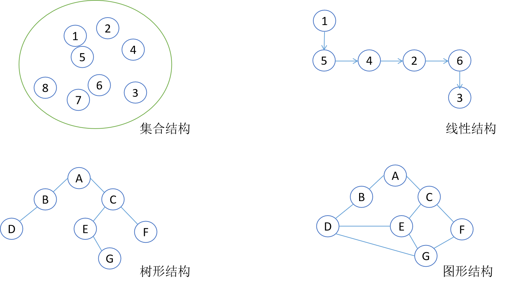
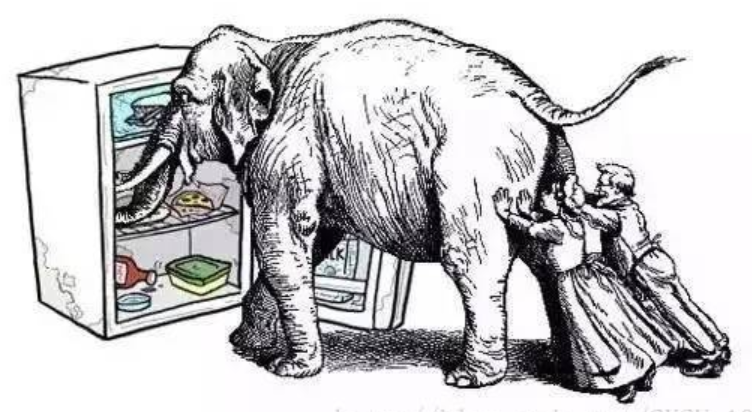

本节是《Java数据结构及算法实战》系列的第1节，主要介绍数据结构和算法概念。

<!-- more -->

对于接触过计算机基础知识的读者而言，对于下面这个公式应该不会陌生：

```
算法 + 数据结构 = 程序
```

提出这一公式并以此作为其一本专著书名<sup>[1]</sup>的瑞士计算机科学家Niklaus Wirth于1984年获得了图灵奖。

程序（Program）是由数据结构（Data Structure）和算法（Algorithm）组成，这意味着的程序的好快是直接由程序所采用的数据结构和算法决定的。

### 什么是数据结构


**数据结构可以简单理解为是承载数据元素的容器，这个容器中的数据元素之间存在一种或者多种特性关系**。比如在Java中，Map和List就是非常常见的数据结构，他们提供了非常方便的方法用于将数据元素添加到这类容器中，同时也提供了在容器中查找数据的方法。

举一个实际的例子，假设我们有一个“学生信息管理系统”需要管理学生的信息，在Java中，我们可以将学生的信息存储在`List<Student>`这个结构中，代码如下：

```java
List<Student> studentList = new ArrayList<>();
```

学生这个类型Student代码如下：

```java
public class Student {
	private Integer age; // 年龄
	private String name; // 姓名
	private String phoneNumer; // 电话号码
	private String address; // 地址

	public Student(Integer age, String name, String phoneNumer, String address) {
		super();
		this.age = age;
		this.name = name;
		this.phoneNumer = phoneNumer;
		this.address = address;
	}

	public Integer getAge() {
		return age;
	}

	public void setAge(Integer age) {
		this.age = age;
	}

	public String getName() {
		return name;
	}

	public void setName(String name) {
		this.name = name;
	}

	public String getPhoneNumer() {
		return phoneNumer;
	}

	public void setPhoneNumer(String phoneNumer) {
		this.phoneNumer = phoneNumer;
	}

	public String getAddress() {
		return address;
	}

	public void setAddress(String address) {
		this.address = address;
	}
}
```

理论上，学生的所有信息，都可以有在Student类型中做映射，但实际上，在设计计算机系统，我们往往只会记录对该系统相关的信息，比如学生的年龄、姓名、电话号码、地址等。我们没有记录诸如学生的爱好、偶像等信息，因为这些信息对于“学生信息管理系统”而言毫无用处。


研究数据结构时，主要是从三个方面入手，这三个方面称为**数据结构的三要素**：

* 数据的物理结构
* 数据的逻辑结构
* 数据的操作（即算法）


#### 1. 物理结构

数据的物理结构，是指数据在计算机中的存储形式。因此，物理结构又叫存储结构。


物理结构可分为四种：顺序存储结构、链式存储结构、索引结构、散列结构。其优缺点总结如下表1-1所示。

表1-1各种物理结构的优缺点


物理结构 | 特征 | 优点 | 缺点
---- | ---- | ---- | ---
顺序存储结构 | 一段连续的内存空间 | 能随机访问 | 插入删除效率低，大小固定
链式存储结构 | 不连续的内存空间 | 大小动态扩展，插入删除效率高 | 不能随机访问
索引存储结构 | 整体无序，但索引块之间有序，需要额外空间，存储索引表 | 对顺序查找的一种改进，查找效率高 | 需额外空间存储索引
散列存储结构 | 数据元素的存储位置与散列值之间建立确定对应关系 | 查找基于数据本身即可找到，查找效率高，存取效率高 | 存取随机，不便于顺序查找

#### 2. 逻辑结构


逻辑结构分为四种类型：集合结构、线性结构、树形结构和图形结构，如下图所示1-1所示。





* 集合结构：就是数据元素同属一个集合，单个数据元素之间没有任何关系。
* 线性结构：类似于线性关系，也就是说，线性结构中的数据元素之间是一对一的关系。线性结构也称为线性表。
* 树形结构：树形结构中的数据元素之间存在一对多的关系。
* 图形结构：数据元素之间是多对多的关系。

因此，数据的逻辑结构通常可以采用一个二元组来表示：

```
Data_Structure = （D，R）
```

其中，D是数据元素的有限集，R是D上关系的有限集。

在上述数据的逻辑结构分类的基础上，还可以进一步细化，衍生出多少种常见的抽象数据类型，包括数组、链表、矩阵、栈、队列、跳表、散列、树、图等。同时，在书中也会给出上述抽象数据类型的Java实现<sup>[2]</sup>。


### 什么是算法

**算法就是解决问题的步骤**。比如，要将大象装进冰箱，需要分为三个步骤：


* 第一步，把冰箱门打开
* 第二步，把大象放进去
* 第三步，把冰箱门关上



在计算机科学领域，算法这个词来描述一种有限、确定、有效的并适合用计算机程序来实现的解决问题的方法<sup>[3]</sup>。算法是计算机科学的基础，是这个领域研究的核心。那么如何来理解算法的有限性、确定性和有效性呢？

* 有限性：算法在有限的执行步骤之后，一定会结束，不会产生无限循环。
* 确定性：算法的每一个指令和步骤都是简洁明确的。
* 有效性：算法的步骤是清晰可行的，换言之，即便用户是用纸笔计算也能求解出答案。


<sub>[1]该书名为*Algorithms + Data Structures = Programs*，在1975年由Prentice Hall出版社出版</sub>

<sub>[2]本书不会对Java语言本身做过多的介绍。如果读者想深入了解Java语言，可以参阅笔者所著的《Java核心编程》。该书在2020年由清华大学出版社出版</sub>


<sub>[3]出自Robert Sedgewick和Kevin Wayne所著的《算法》一书。该书第4版在2012年由人民邮电出版社出版</sub>


## 参考引用

* 原本同步至：<https://waylau.com/what-are-data-structures-and-algorithms/>
* 本系列归档：<https://github.com/waylau/java-data-structures-and-algorithms-inaction>
* 数据结构和算法基础（Java语言实现）：<https://item.jd.com/13014179.html>