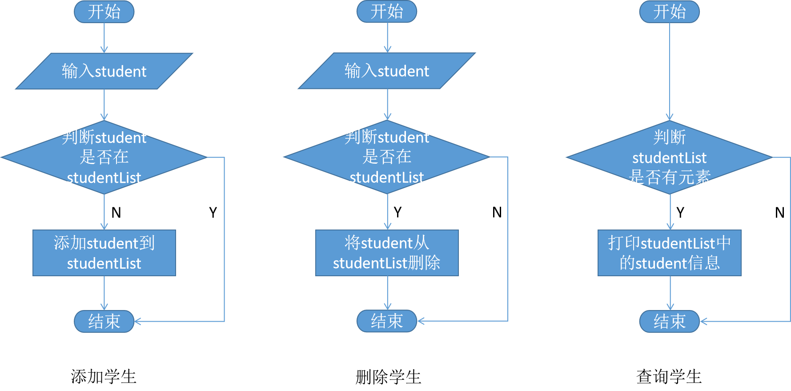

本节是《Java数据结构及算法实战》系列的第2节，主要介绍描述算法的常用的4种方式。

<!-- more -->

要定义一个算法，我们可以用自然语言、流程图、伪代码的方式描述解决某个问题的过程或是编写一段程序来实现这个过程。比如，在前面所举的“学生信息管理系统”例子中，我们希望实现添加用户、删除用户、查询用户三个算法。

#### 1. 自然语言描述算法

可以采用自然语言的方式来描述添加用户、删除用户、查询用户三个算法：

* 添加用户：将用户信息添加到系统中。如果已经添加了过该用户的信息，则提示用户。否则将用户信息添加到系统中，并给出提示。
* 删除用户：将用户信息从系统中删除。如果用户信息不存在于系统中，则提示用户。否则将用户信息从系统中删除，并给出提示。
* 查询用户：将系统中所有的用户信息查询出来。如果系统中不存在用户，则提示用户。否则将用户信息查询出来返回，并将用户信息打印出来。

使用自然语言描述的好处是任何人都能看懂。当然相比于伪代码或者程序语言而言，使用自然语言描述有时会显得繁琐。


#### 2. 流程图描述算法


流程图（Flow Diagram）是一种通用的图形符号表示法是一种非正式的，可以清楚描述步骤和判断。图1-2展示的是用流程图的方式来描述添加用户、删除用户、查询用户三个算法。





相比较自然语言而言，通过流程图的描述，可以很清楚的看到操作的流向及经过的步骤。但需要注意的是，流程图应该只描述核心的操作步骤以及关键的节点判断，而不是事无巨细的把所有的操作都描述出来，否则只会让整个图看上去复杂难以理解。

#### 3. 伪代码描述算法


伪代码（Pseudocode）是一种非正式的，类似于英语结构的，用于描述模块结构图的语言。可以采用伪代码的方式来描述添加用户、删除用户、查询用户三个算法。

添加用户的伪代码如下：

```
input(student)
if student in studentList
    print "Student exsit"
else 
    add student in studentList
    print "Add student success"
```

删除用户的伪代码如下：

```
input(student)
if student in studentList
    remove student from studentList
    print "Remove student success"
else 
    print "Student not exsit"
```


查询用户的伪代码如下：

```
if student in studentList
    output studentList
else 
    print "No student exsit"
```

伪代码结构清晰、代码简单、可读性好，并且类似自然语言。介于自然语言与编程语言之间。以编程语言的书写形式指明算法职能。使用伪代码，不用拘泥于具体实现。相比程序语言（例如Java、C++、C等等）它更类似自然语言。它虽然不是标准的语言，却可以将整个算法运行过程的结构用接近自然语言的形式（可以使用任何一种你熟悉的文字，关键是把程序的意思表达出来）描述出来。


#### 4. 程序语言描述算法

程序语言描述算法，实际上就是用程序语言实现算法。不同的编程语言其语法不尽相同。以下是采用Java语言的方式来描述添加用户、删除用户、查询用户三个算法。


```java
import java.util.ArrayList;
import java.util.List;

public class StudentInfoManageSystem {

	private List<Student> studentList = new ArrayList<>();

	public void addStudent(Student student) {
		// 如果已经添加了过该用户的信息，则提示用户。
		// 否则将用户信息添加到系统中，并给出提示。
		if (studentList.contains(student)) {
			System.out.println("Student exsit");
		} else {
			studentList.add(student);
			System.out.println("Add student success");
		}
	}

	public void removeStudent(Student student) {
		// 如果用户信息不存在于系统中，则提示用户。
		// 否则将用户信息从系统中删除，并给出提示。
		if (studentList.contains(student)) {
			studentList.remove(student);
			System.out.println("Remove student success");
		} else {
			System.out.println("Student not exsit");
		}
	}

	public List<Student> getStudentList() {
		// 如果系统中不存在用户，则提示用户。
		// 否则将用户信息查询出来返回，并将用户信息打印出来。
		if (studentList.isEmpty()) {
			System.out.println("No student exsit");
		} else {
			for (Student s : studentList) {
				System.out.format("Student info: name %s, age %d, phone %s, address %s%n", 
						s.getName(), s.getAge(), s.getPhoneNumer(), s.getAddress());
			}
		}

		return studentList;
	}
}
```

为了演示上述算法，还需要一个应用入口。我们用StudentInfoManageSystemDemo类来表示应用主程序，代码如下：

```java
import java.util.ArrayList;
import java.util.List;

public class StudentInfoManageSystemDemo {

	public static void main(String[] args) {
		// 初始化系统
		StudentInfoManageSystem system = new StudentInfoManageSystem();

		// 初始化学生信息
		Student student = new Student(32, "Way Lau", "17088888888", "Shenzhen");

		// 添加学生
		system.addStudent(student); // Add student success

		// 再次添加学生
		system.addStudent(student); // Student exsit

		// 第一次查询所有学生
		List<Student> studentList = system.getStudentList();

		// 删除学生
		system.removeStudent(student); // Remove student success

		// 再次删除学生
		system.removeStudent(student); // Student not exsit

		// 查询所有学生
		studentList = system.getStudentList(); // No student exsit

	}

}
```


运行上述程序，可以看到控制台输出内容如下：


```
Add student success
Student exsit
Student info: name Way Lau, age 32, phone 17088888888, address Shenzhen
Remove student success
Student not exsit
No student exsit
```

程序语言描述算法一步到位，写出的算法可直接交予计算机处理。对于懂得这类程序语言的开发者而言，通过运行程序可以马上验证算法的正确性。当然其缺点也较为明显：

* 不便于体现自顶向下、逐步求解的思想；
* 程序语言包含很多细节内容，会淹没算法的主要思想。

因此，在描述某个算法时，往往通过几种描述方式结合起来使用。


## 参考引用

* 原本同步至：<https://waylau.com/description-of-algorithms/>
* 本系列归档：<https://github.com/waylau/java-data-structures-and-algorithms-in-action>
* 数据结构和算法基础（Java语言实现）：<https://item.jd.com/13014179.html>