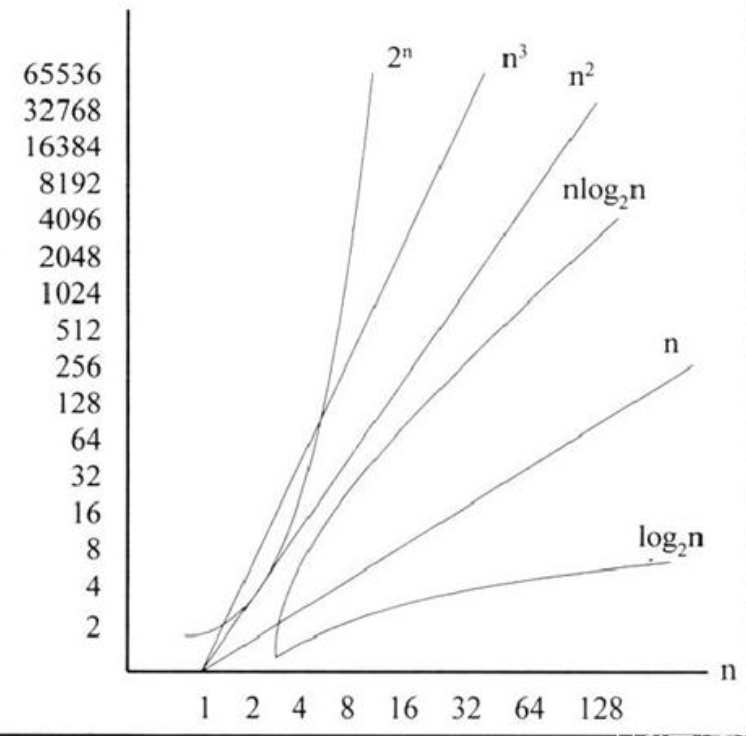

本节是《Java数据结构及算法实战》系列的第6节，主要介绍算法复杂度等级及其分析的方法。

<!-- more -->

在前一节，我们介绍了程序的性能，也介绍了评估性能的方式。那么，我们是否就能测算出算法需要运行的时间呢？
在上一节，我们了解算法复杂度的度量规则，接下来我们将学会如何对各个具体算法的复杂度进行分析。按照渐进复杂度的思想，可以将算法的复杂度按照高低划分为若干典型的级别。这种分类方法，也被称为**函数的界**或者**函数的阶**。

## 1. 常数的时间复杂度O(1)


首先来看这样一个“取非极端元素”问题：给定整数子集S，`+∞ > |S| = n ≥ 3`，从中找出一个元素`a∈S`，使得`a ≠ max(S)`且`a ≠ min(S)`。也就是说，在最大、最小者之外，取出任意一个数。


这一问题，可以用以下伪代码描述的算法解决：

```
x = S[0]
y = S[1]
z = S[2]
list = sort(x, y, z)
output list[1]
```

针对上述问题，我们注意到，既然S是有限集，故其中的最大、最小元素各有且仅有一个。因此，无论S的规模有多大，在前三个元素`S[0]`、`S[1]`和`S[2]`中，必包含至少一个非极端元素。于是，我们可以取`x = S[0]`、`y = S[1]`和`z = S[2]`，这只需执行三次基本操作，耗费O(3)时间。接下来，为了确定这三个元素的大小次序，我们最多需要做三次比较，也是O(3)时间。最后，输出居中的那个元素只需O(1)时间。

综合起来，上述问题的运行时间为：

```
T(n) = O(3) + O(3) + O(1) = O(7) = O(1) 
```

也就是说，上述问题的算法具有**常数的时间复杂度**。


## 2. 对数的时间复杂度O(logn)

考虑如下“进制转换”问题：给定任一十进制整数，将其转换为三进制表示。比如

```
23(10) = 212(3)
101(10) = 10202(3)
```

这一问题，可以以下伪代码描述的算法解决：

```
while(n != 0) 
    n mod 3    // 取模
    n = n/3    // 整除
```


以101(10)为例。第一轮循环，输出

```
101 mod 3 = 2
n = 100/3 = 33
```

第二轮循环，输出

```
33 mod 3 = 0
n = 33/3 = 11
```

第三轮循环，输出 


```
11 mod 3 = 2
n = 11/3 = 3
````

第四轮循环，输出 

```
3 mod 3 = 0
n = 3/3 = 1
```

第五轮循环，输出 

```
1 mod 3 = 1
n = 1/3 = 0
```

至此算法结束。请注意，以上各个数位是按照从低到高的次序输出的，所以转换后的结果应该是10202(3)。

我们以整数n的大小作为输入规模，来分析上述算法的运行时间。该算法由若干次循环构成，每一轮循环内部，都只需进行两次基本操作（取模、整除）。为了确定需要进行的循环轮数，我们可以注意到以下事实：每经过一轮循环，n都至少减少至1/3。于是，至多经过1+log3^n次循环，即可减小至0。


也可以从另一个角度来解释这一结果。该算法的任务是依次给出三进制表示的各个数位，其中的每一轮循环，都恰好给出其中的一个数位。因此，总共需要进行的循环轮数，应该恰好等于n的三进制表示的位数，即1+log3^n。因此，该算法需要运行的时间为：

```
O(2×(1+log3^n)) = O(log3n)
```

鉴于大O记号的性质，通常会忽略对数函数的常底数。比如这里的底数为常数3，故通常将上述复杂度记作O(logn)。此时，我们称这类算法具有**对数的时间复杂度**。


## 3. 线性的时间复杂度O(n)


考虑如下“数组求和”问题：给定n个整数，计算它们的总和。


这一问题，可以以下伪代码描述的算法解决：

```
input(S))
s = 0
for a in S  // 遍历数据S中的元素a
    s += a
output s
```


上述算法，对s的初始化需要O(1)时间。算法的主体部分是一个循环，每一轮循环中只需进行一次累加运算，这属于基本操作，可以在O(1)时间内完成。每经过一轮循环，都对一个元素进行累加，故总共需要做n轮循环。因此，上述算法一的运行时间为：

```
O(1) + O(1)×n = O(n+1) = O(n) 
```

我们称这类算法具有**线性的时间复杂度**。

## 4. 平方的时间复杂度O(n^2)


我们⎯⎯起看下一个经典的排序问题：将n个整数排成一个非降序列。

排序算法种类繁多，这里我们采用“冒泡排序”。冒泡排序算法又称为交换排序法，是从观察水中气泡变化构思而成。其原理是从第一个元素开始，比较相邻元素的大小，若大小顺序有误，则对调后再进行下一个元素的比较，就仿佛气泡从水底逐渐冒升到水面一样。如此扫描一次之后，就可以确保最后一个元素是位于正确的顺序。接着再逐步进行第二次扫描，直接完成所有元素的排序关系为止。


以下伪代码描述的冒泡排序算法：

```
input(S)
for (i=0; i>0; i--)       // 扫描次数，比较n个值 
    for (j=0; j<i; j++)   // 比较、交换次数
        if S[j] > S[j+1]  // 比较，如果前面的数比后面的数大，则发生交换
            temp = S[j]
            S[j] = S[j+1]
            S[j+1] = temp // 后面的数和前面的发生交换
output S
```


为了对n个整数排序，冒泡排序必须执行n-1次扫描，最坏情况和平均情况均比较次数如下：

```
(n-1) + (n-2) + (n-3) + ... + 3 + 2 + 1 = n(n-1)/2 
```

执行次数为n(n-1)/2，鉴于大O记号的特性，低次项可以忽略，常系数可以简化为1，故时间复杂度为：

```
T(n) = O(n^2)
```

这类算法我们称为具有**平方时间复杂度**。对于其它一些算法，n的次数可能更高，但只要其次数
为常数，我们都统称之为**多项式时间复杂度**。


## 5. 指数的时间复杂度O(2^n)


再来考虑幂函数的计算问题：给定非负整数n，计算2^n。


为了解决这一问题，可以用以下伪代码描述该算法：

```
input(n)
power = 1
while (0 < n--) 
    power = power * 2
output power
```


上述算法总共需要做n次迭代，每次迭代只涉及常数次基本操作，故总共需要运行O(n)时间。按照如上定义，问题的输入规模为n，故有O(n) = O(2^n)。我们称这样的算法具有**指数的时间复杂度**。

从常数、对数、线性到平方时间复杂度，算法的效率不断下降，但就实际应用而言，这类算法的效率还在允许的范围内。然而，在多项式时间复杂度与指数时间复杂度之间，却有着一道巨大的鸿沟，通常我们都认为，指数复杂度的算法无法应用于实际问题之中，它们不是有效的算法，甚至不能称作算法。因此，在实际项目中，应该避免设计出指数时间复杂度的算法。


## 6. 算法复杂度总结


算法复杂度总常见的表示形式为常数级O(1)、对数级O(logn)、线性级度O(n)、平方级O(n^2)、指数级O(2^n)，其运算时间的典型函数增长情况如图1-5所示。





简单来说，当n足够大时，复杂度与时间效率有如下关系（c是一个常量）：

```
c < log2^n < n < nlog2^n < n^2 < n^3 < 2^n < 3^n
```

## 参考引用

* 原本同步至：<https://waylau.com/algorithm-complexity-level/>
* 本系列归档至《Java数据结构及算法实战》：<https://github.com/waylau/java-data-structures-and-algorithms-in-action>
* 《数据结构和算法基础（Java语言实现）》：<https://item.jd.com/13014179.html>