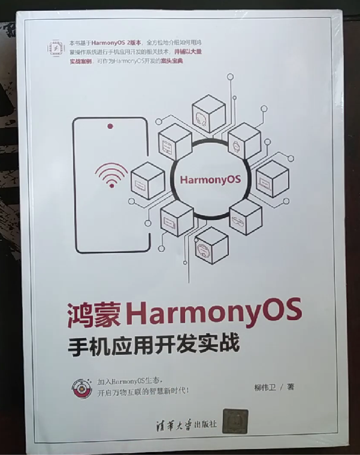
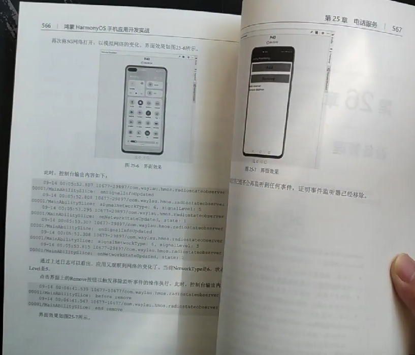
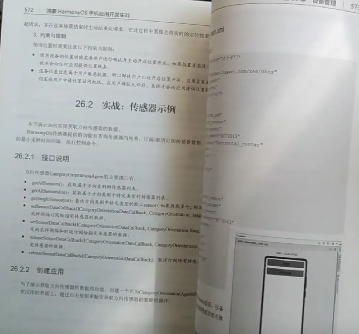

《鸿蒙HarmonyOS手机应用开发实战》一书由清华大学出版社出版，已经于2022年1月上市。拿到了样书，第一时间希望与读者朋友们分享下这本书里面的内容。

<!-- more -->

## 这本书的背景

近期拿到了样书，迫不及待的对新书做了浏览。同时也做了拆书与导读，可以在B站找到：<https://www.bilibili.com/video/BV1gL411c7hg/>

 
聊下为啥要写这本书。

中国信息产业一直是“缺芯少魂”，其中的“芯”指的是芯片，而“魂”则是指操作系统。而自2019年5月15日起，美国陆续把包括华为在内的中国高科技企业列入其所谓的“实体清单”（Entities List），标志着科技再次成为中美博弈的核心领域。
随着谷歌暂停与华为的部分合作，包括软件和技术服务的转让，华为在国外市场已经面临着升级Android版本、搭载谷歌服务等方面的困境。在这样的背景下，华为顺势推出HarmonyOS，以求在操作系统领域不受制于人。HarmonyOS是一款面向未来、面向全场景（移动办公、运动健康、社交通信、媒体娱乐等）的全新的分布式操作系统。作为操作系统领域的新成员，HarmonyOS势必会面临bug多、学习资源缺乏等众多困难。为此，笔者在开源社区以开源方式推出了免费系列学习教程《跟老卫学HarmonyOS开发》 ，以帮助HarmonyOS爱好者入门。同时，为了让更多的人了解并使用HarmonyOS，笔者将自身工作、学习中遇到的问题、难题进行了总结，形成了本书，以补市场空白。

## 几个特点

概况起来，这本《鸿蒙HarmonyOS手机应用开发实战》主要有以下几个特点。B站也有相关介绍：<https://www.bilibili.com/video/BV1gL411c7hg/>

### 1、涉及面非常广

那么涉及广的话可以体现在哪里呢？可以看这本书的内容简介部分。
本书采用新的HarmonyOS 2版本作为基石，详细介绍如何基于HarmonyOS进行手机应用的开发，内容涵盖HarmonyOS架构、DevEco Studio、应用结构、Ability、任务调度、公共事件、通知、剪切板、Java UI、JS UI、多模输入、线程管理、视频、图像、相机、音频、媒体会话管理、媒体数据管理、安全管理、二维码、通用文字识别、蓝牙、WLAN、网络管理、电话服务、设备管理、数据管理、原子化服务、流转等多个主题。本书辅以大量解决实际问题的案例，具有很强的前瞻性、应用性、趣味性。

可以说，HarmonyOS常见的知识点这本书都已经涉及了，毕竟713页的篇幅不是盖的。更难能可贵的是，这本书也对当前比较新的特新诸如原子化服务、流转也做了讲解。

### 2、图例非常丰富

这本书是他这个图例非常丰富，从基本的IDE安装，到复杂的数据结构的演示，都有丰富的图例。通过图例的配套讲解演示，可以方便读者理解。

 
### 3、详细的接口说明

每个用到的API的用法都给你描述的详详细细的。
 
### 4、代码量非常大

第三个特点的话就是它里面的实战案例非常丰富。实战案例体现在，这本书的每一章每个知识点基本上会配套一个实战案例，代码量是非常大的。每行代码这个重点代码它都有一些注释给你写得明明白白。

这本书呢是不单只是简单的讲一些理论，它还有会手把手的教你写代码。理论联系实际。

### 5、本书开源

本书也是有配套的开源书籍，如果不想花钱，也是有免费版本的哦，见《跟老卫学HarmonyOS开发》<https://github.com/waylau/harmonyos-tutorial>

学习本书，一起构建万物互联的时代！

## 参考引用

* 原本同步至：<https://waylau.com/harmonyos-mobile-application-development-book/>
* 京东有售：<https://item.jd.com/13568130.html>