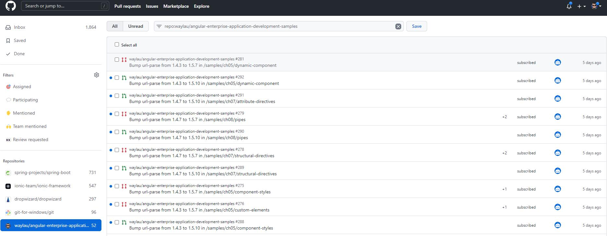
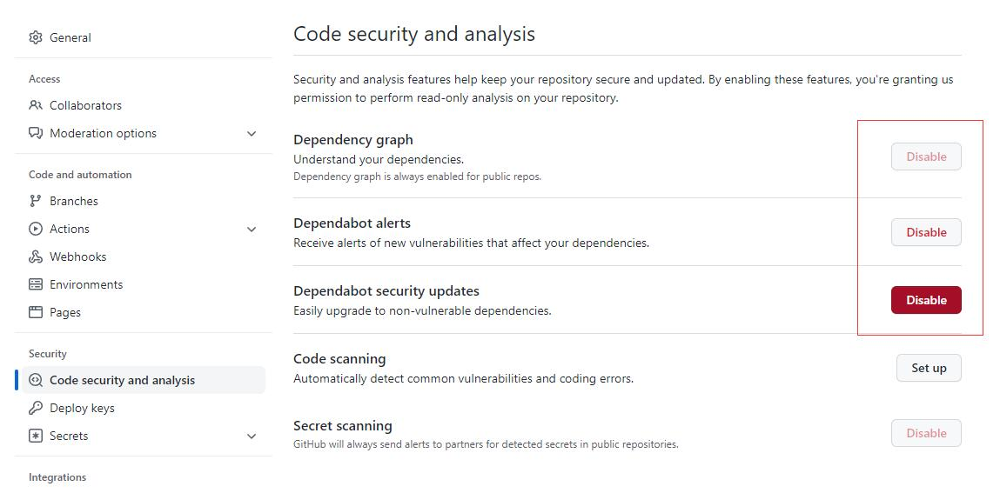

Github Dependabot是个好东西，它是GitHub的工具，可以帮助检测你的repo， 并且做一些工作保证你repo的安全性。

但有时，我也面临了已经收到太多Dependabot提示信息，对我造成了骚扰。于是我想要禁用Dependabot。

<!-- more -->

## Dependabot的作用

Dependabot可以为你repo做的事情主要分成三大类：

* 实时检测你的repo，并keep你所有的dependency都能被updated
* 检测vulnerable dependencies并发出Dependabot alert
* 帮助你停止使用有vulnerable的dependencies

## Dependabot带来的负面影响

给我带来最大的影响是，Dependabot会自动提交代码，从而产生了很多提醒。而这些repo我并不想更新，也不想处理这些提醒。

毕竟过多的提醒，就是浪费我的时间。

## 禁用Dependabot

禁用Dependabot的方法也很简单，去到repo的设置界面的“Code security and analysis”，按需禁用Dependency graph 和 Dependabot alerts 即可。

## 参考引用

* 原本同步至：<https://waylau.com/disable-dependabot/>
* GitHub帮助文档：<https://github.com/waylau/github-help>