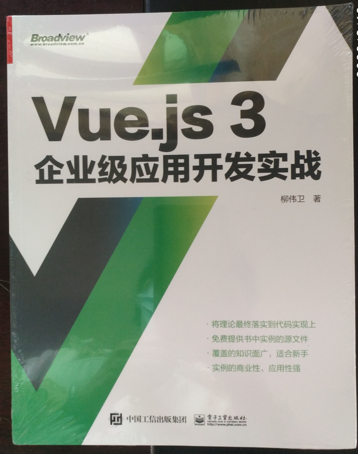
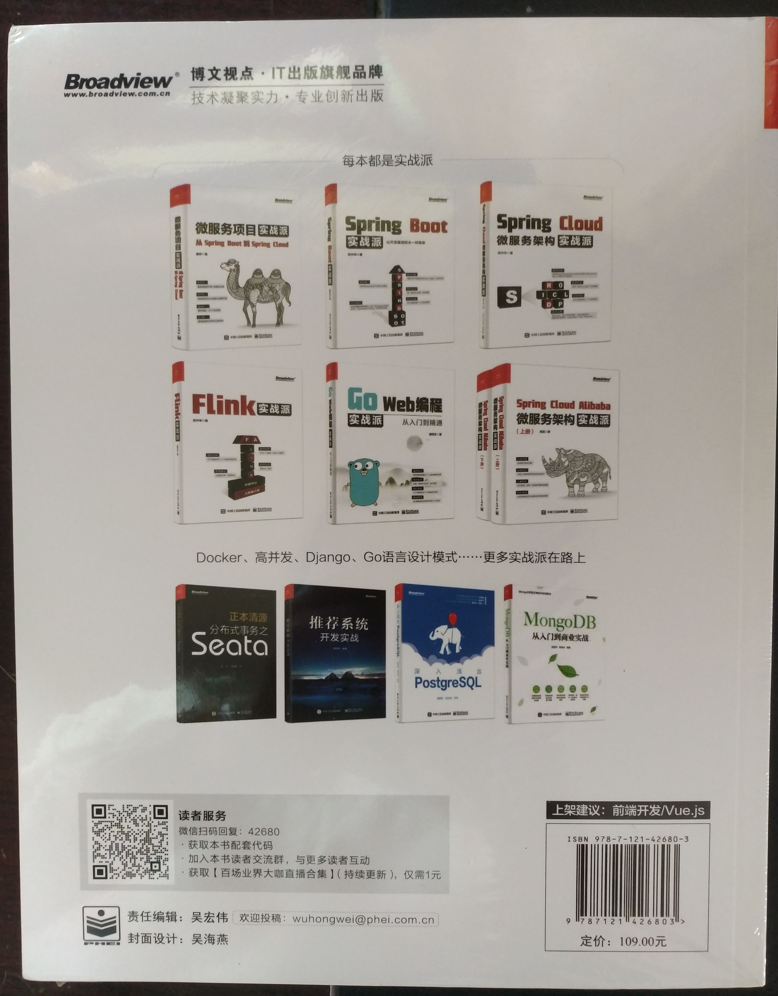

《Vue.js 3企业级应用开发实战》一书由电子工业出版社出版，已经于2022年1月出版上市。近日拿到了样书，第一时间希望与读者朋友们分享下这本书里面的内容。

<!-- more -->

## 这本书的背景

近期拿到了样书，迫不及待的对新书做了浏览。同时也做了拆书与导读。

 
聊下为啥要写这本书。

Vue.js是近些年广受关注的前端框架。Vue.js已经具备了商业项目开发的必备条件，如语法精炼、优雅而简洁、代码的可读性高、成熟的组件模块化等等，当然，还有商业项目开发最为看重的与第三方控件的结合能力。正是这些能力，确保了“后浪”Vue.js能够与React、Angular等老牌前端开发框架并驾齐驱，在开发者当中占据越来越重要的位置。和React、Angular相比，Vue.js在可读性、可维护性和趣味性之间做到了很好的平衡，非常使用中小型项目的快速开发。随着Vue.js 3的推出，Vue.js具备了进军大型项目开发的可能性。

市面上关于Vue.js 1.x和2.x版本的介绍资料比较多，但由于Vue.js 3是近期才发布，因此，市面上有关ue.js 3的资料比较匮乏。于是，笔者在GitHub上，以开源方式撰写了《跟老卫学Vue.js开发》开源书（<https://github.com/waylau/vuejs-enterprise-application-development>），介绍Vue.js 3的使用。同时，考虑到能让更多的人学习到Vue.js，于是笔者以该开源书为蓝本，对Vue.js 3的知识点做了完整的梳理和扩展，补充了实战案例，出版了《Vue.js 3企业级应用开发实战》一书以补空白。希望读者通过本书的学习，掌握Vue.js 3企业级应用开发实战的能力。

## 这本书的内容

本书大致分为以下几个部分：

* 准备（第1-2章）：了解Vue.js基础概念，并带领读者快速创建一个Vue.js应用，使读者对Vue.js有一个初步的印象。
* 入门（第3-11章）：了解TypeScript基础、Vue.js应用实例、组件基础、模板、计算属性与监听器、样式、表达式、事件、表单等概念。通过这几章的学习，读者可以了解到 Vue.js常用的知识点。
* 进阶（第12-18章）：深入讲解Vue.js高级知识点。
* 实战（第19-22章）：手把手带领读者一起从零开始实现一个完整的企业级新闻头条客户端应用，使读者具备Vue.js企业级应用开发的完整的能力。

## 这本书的特点

概况起来，这本《Vue.js 3企业级应用开发实战》主要有以下几个特点。

### 1．可与笔者在线上交流

本书提供线上交流网址：<https://github.com/waylau/vuejs-enterprise-application-development/issues>

读者有任何技术上的问题，都可以向笔者提问。

### 2．提供了基于知识点的77实例和6个综合性实战案例

本书提供了丰富的基于Vue.js 3技术点的实例77个，将理论讲解最终落实到代码实现上来。在掌握了基础之后，另外提供了6个综合性实战案例。这些案例从零开始，最终实现了一个完整的企业级应用，内容具有很高的应用价值和参考性。

### 3．免费提供书中实例的源文件

本书提供了书中涉及的所有实例的源文件。读者可以一边阅读本书，一边参照源文件动手练习，这样不仅提高了学习的效率，而且可以对书中的内容有更加直观的认识，从而逐渐培养自己的编程能力。

源码见：<https://github.com/waylau/vuejs-enterprise-application-development/>

### 4．覆盖的知识面广

本书几乎囊括了Vue.js 3所涉及的包括应用实例、组件、模板、计算属性、监听器、指令、表单、事件、数据绑定、路由、依赖注入、自定义样式、动画、渲染函数、测试、响应式编程等方面内容，同时介绍了Vue CLI、TypeScript、Animate.css、Mocha、Vue Router、Naive UI、vue-axios等Vue.js周边生态方面的内容，技术前瞻，案例丰富。不管是编程初学者，还是编程高手，都能从本书中获益。本书可作为读者案头的工具书，随手翻阅。

### 5．采用短段、短句，便于流畅阅读

本书采用结构化的层次，并采用短小的段落和语句，让读者读来有顺水行舟的轻快感。

### 6．案例的商业性、应用性强

本书提供的案例多数来源于真正的商业项目，具有高度的参考价值。有些代码甚至可以直接移植到自己的项目中，进行重复使用，使从“学”到“用”这个过程变得更加直接。

## 参考引用

* 原本同步至：<https://waylau.com/vuejs-enterprise-application-development/>
* 京东有售：<https://item.jd.com/13624356.html>
* 当当有售：<http://product.dangdang.com/29373978.html>