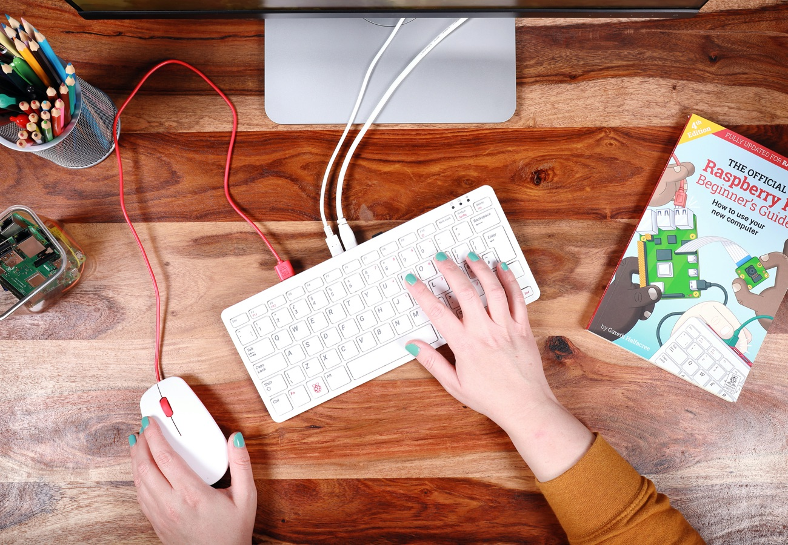
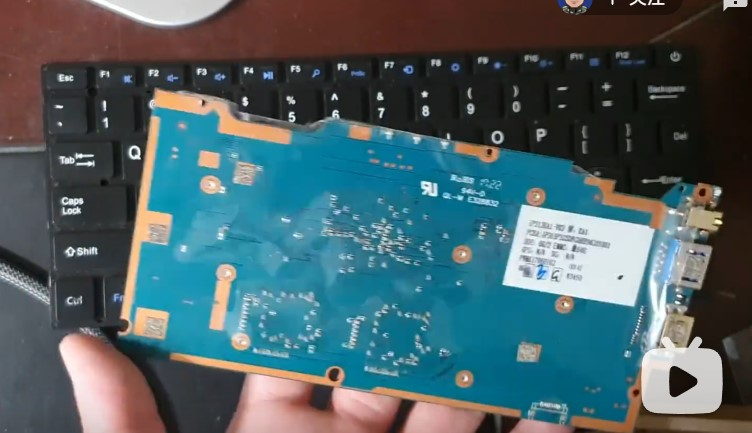
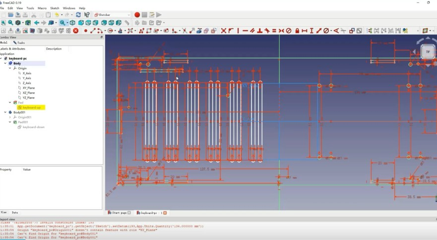
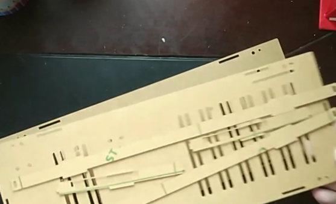
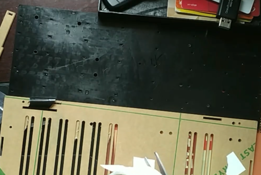
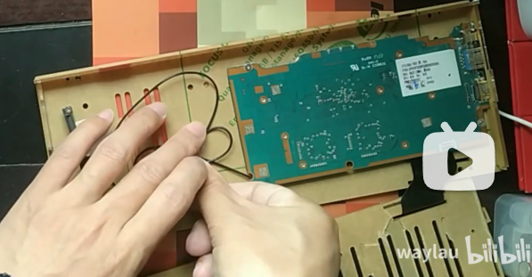
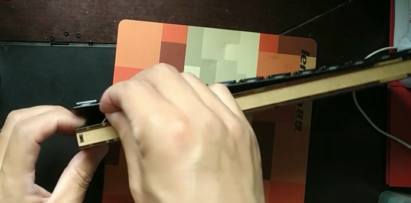
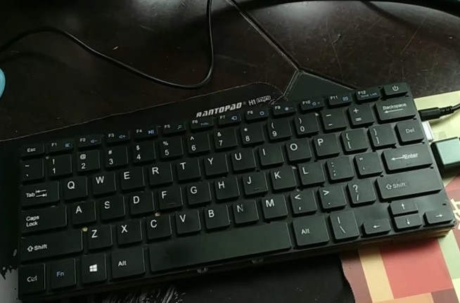
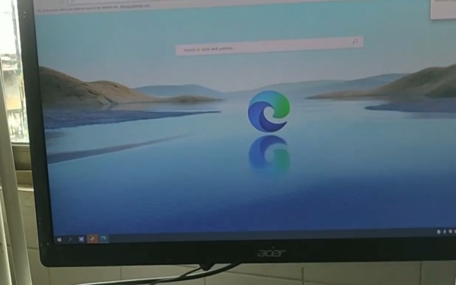

本文介绍，如何实现一台类似于点Raspberry Pi 400那样的键盘主机。

<!-- more -->

完整视频教程可见B站：<https://www.bilibili.com/video/BV16Y4y1p7nv/>

## 准备材料

* 笔记本电脑主板：我这个是N3450四核主板，6G+64G存储
* 笔记本键盘：某不知名品牌YEPO笔记本键盘

有关主板和键盘的信息，可见B站视频：<https://www.bilibili.com/video/BV1DS4y1F7TG/>

## 制作主机外壳CAD

外壳采用免费、开源软件FreeCAD制作。

由于我是第一次使用CAD软件，所以这个设计图我画了一个礼拜。

 

设计考虑了散热、主板安装的位置，并且预先保留了硬盘位。

这些位置的预留要严格测量好位置，否则可能会安装不上。

上述设计图我也开源了，有兴趣的同学开源见文后“参考引用”。

## 定制亚克力外壳

将CAD图纸发给厂商，厂商就会给切割好亚克力面板过来。

我这个外壳是6面。

## 安装

键盘是用双面胶粘在面板上的。

键盘排线与主板相连。

 
最后用螺丝固定上下面板。
 

## 测试

组装完成，进行测试。

 
将键盘主机连上电脑显示器、电源、鼠标。

开源看到能够正常运行了。
 

最后称了一下，只有290g重量。

## 总结

键盘主机给了我一个非常好的设计思路，它有以下几方面的优点：

* 非常节省空间。比笔记本小，甚至比一般的键盘都要迷你。
* 非常轻。也就比一般的手机重点。
* 功能完整。他既是一台主机，同时也是键盘，连上显示器就能用了。
* 安静。这个键盘放到哪里都不突兀，无风扇被动式散热。
* 低功耗。用来远程办公、看视频、做下载机都很不错哦。

解锁更多好玩的DIY产品，关注我。

## 参考引用

原文同步至：<https://waylau.com/diy-keyborad-pc/>
CAD设计图开源：<https://github.com/waylau/freecad-tutorial>
Raspberry Pi 400：<https://www.raspberrypi.com/products/raspberry-pi-400/>
