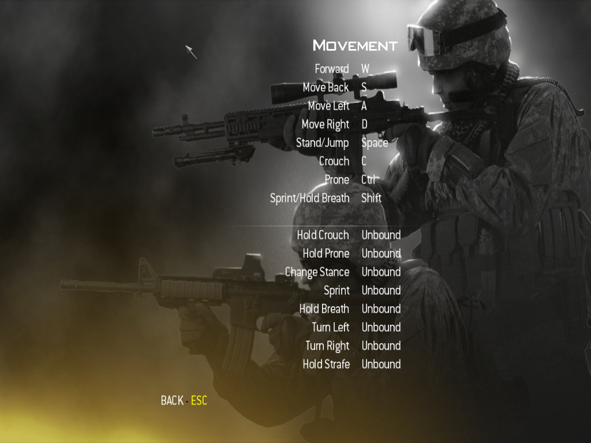
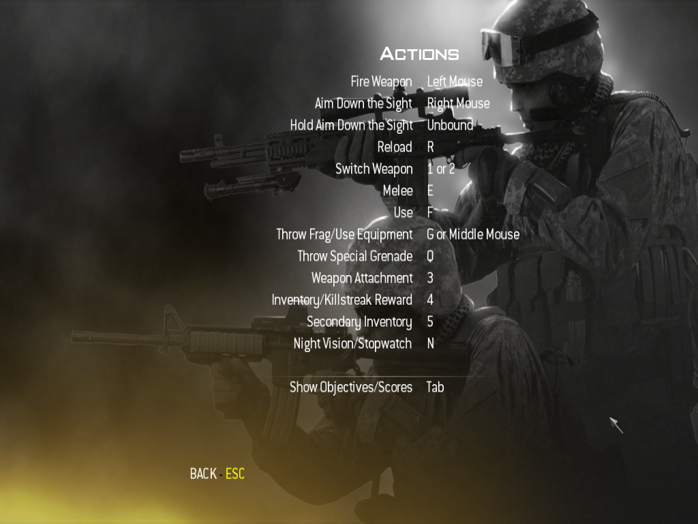
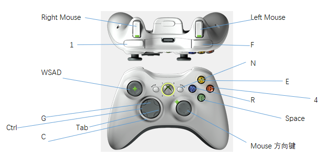

本文介绍新买的手柄，在进行游戏前，如何做键位映射。本文涉及：

* 手柄：乐视无线游戏手柄 尚酷版 LeWGP-201
* 软件：x360ce、JoyToKey
* 游戏：《使命召唤4》(Call of Duty 4: Modern Warfare)

<!-- more -->
 

## 了解游戏的操作键

以《使命召唤4》游戏为例。涉及的按钮如下。

* W 前进 
* S 后退 
* A 左移动 
* D 右移动 
* Space 恢复站姿（在蹲下或卧倒时） 跳 翻越障碍物体 
* C 蹲下 
* Ctrl 卧倒 
* Shift 短跑 如果是打开狙击枪的准心时按就是屏气瞄准 

 
* Left Mouse 开火 
* Right Mouse 打开准心 
* R 装弹
* 1 主武器 /2 副武器 
* E 混战
* F 作用键 比如装炸(和谐)弹 换枪 抱人（特有的关卡才有这个动作） 
* G 扔手雷 鼠标的滑轮也有这个作用 
* Q 扔出药物
* 3 武器配件
* 4 扔闪光弹、呼叫空中打击 
* 5 备选库存
* N 夜视
* Tab 查看任务和地图	

上面的需要的操作键非常多，但我们的手柄的按键是有限的，因此，选出必要的操作键。

## 使用 JoyToKey做键位映射

使用JoyToKey软件，来将手柄的按键映射到键盘和鼠标的按键上去。
 

## 完整设置过程

见视频：<https://www.bilibili.com/video/BV1KL4y1w7Ed/>

