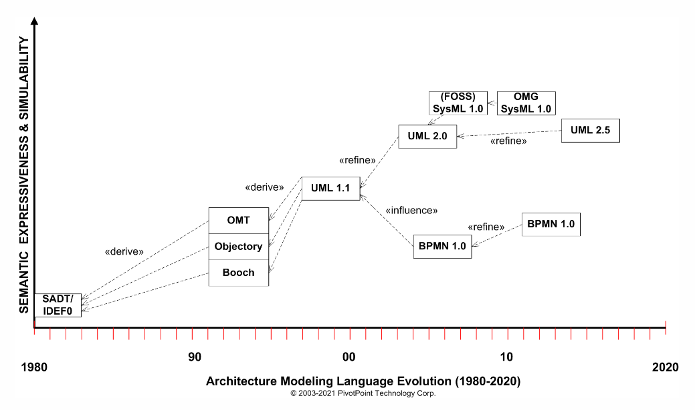
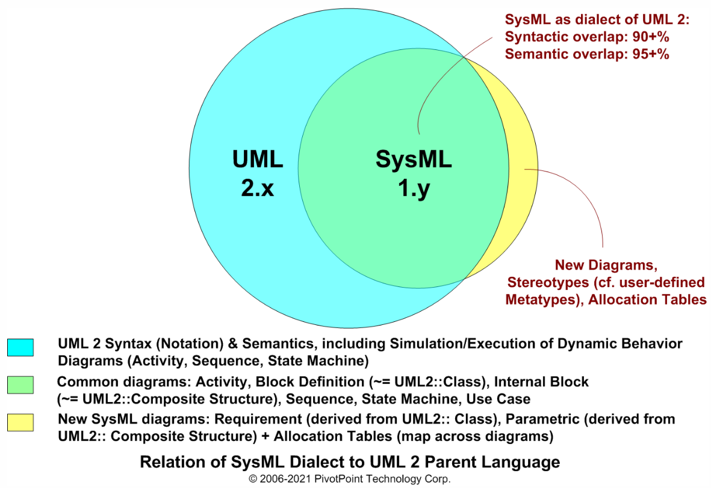
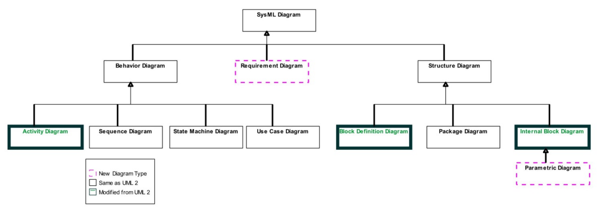

本文解答了什么是SysML、SysML与UML有什么区别。

<!-- more -->

## 什么是SysML

故名思议，SysML就是Systems Modeling Language的简写，中文翻译为“系统建模语言”。

* SysML是一种用于系统工程应用程序的通用系统体系结构建模语言，支持各种系统和系统中系统的规范、分析、设计、验证和验证。这些系统可能包括硬件、软件、信息、过程、人员和设施。
* SysML是UML2的一种方言，被定义为UML2概要文件。
* SysML是一种用于基于模型的系统工程（Model-Based Systems Engineering，简称MBSE）的使能技术。

SysML最初是由SysML合作伙伴的SysML开源规范项目于2003年创建的。SysML在2006年被对象管理小组（OMG）改编并采用为OMG SysML。

## SysML与UML有什么区别

从下图可以看到SysML与UML的异同点。

SysML使用了UML大部分的概念，抛弃了一部分概念，并扩展了一部分概念（需求图扩展了UML类图；参数图扩展了UML类和复合结构图）。SysML相比较UML而言更为轻量级和辩证，因为SysML最初被设计为由系统工程师与应用UML进行软件分析和设计的软件工程师合作使用，并且SysML被定义为UML2的适度扩展的实用子集。

SysML主要是使用如下图所示的9类图。

## 参考

* OMG SysML v1.6：<https://sysml.org/.res/docs/specs/OMGSysML-v1.6-19-11-01.pdf>
