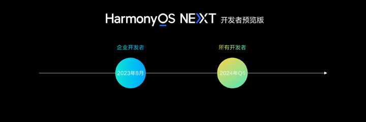

在“[鸿蒙系统实战短视频App 从0到1掌握HarmonyOS](https://coding.imooc.com/class/674.html)”视频课程中，很多学员来问我，在HarmonyOS开发过程中，面对Java与ArkTS，应该选哪样？

本文详细分析Java与ArkTS在HarmonyOS开发过程的区别，力求解答学员的一些困惑。

<!-- more -->


## 何为HarmonyOS？

在讨论语言的差异时，我们先了解下什么是HarmonyOS。华为官方是这么解释HarmonyOS的：

```
“鸿蒙操作系统”特指华为智能终端操作系统。“鸿蒙操作系统”具有以下三大特征：

一是一套操作系统可以满足大大小小设备需求，实现统一OS，弹性部署；
二是搭载该操作系统的设备在系统层面融为一体、形成超级终端，让设备的硬件能力可以弹性扩展，实现设备之间硬件互助，资源共享；
三是面向开发者，实现一次开发，多端部署。
```


HarmonyOS就是“鸿蒙操作系统”的英文名，也简称为“鸿蒙OS”，是基于 OpenHarmony、AOSP等开源项目的商用版本。

这里需要注意：

* 一是HarmonyOS不是开源项目，而是商用版本。
* 二是HarmonyOS手机和平板之所以能运行Android程序，是因为HarmonyOS 实现了现有Android生态应用（即AOSP）的运行。


详细参见我的另外一篇文章《[一文搞懂什么是鸿蒙、OpenHarmony、HarmonyOS](https://waylau.com/what-is-harmonyos/)》。


当然，HarmonyOS的志愿远非如此，未来有可能会完全剥离掉AOSP（详见HarmonyOS Next项目），当然，其结果必然是不再兼容Android，无法在HarmonyOS上运行Android程序。


## 何时发布HarmonyOS Next？

在今年的HDC 2023上，华为宣布了HarmonyOS NEXT开发者预览版。开发者如果想体验到HarmonyOS NEXT，估计要等到明年的第一季度。

HarmonyOS NEXT除了剥离掉AOSP之外，可能是完全只使用自家的LiteOS内核。





当然，决定一个系统是否成功，看得是这个系统的生态。如果一个操作系统，连几款像样的应用都没有，自然是不能算成功的。一个良性的操作系统生态，必然是一个广大软件厂商都愿意投入的生态。这也是为什么这么多年Windows在国内大行其道，主要还是因为那些国产的Linux系统始终没法提供完整的办公体验，比如像这些微信、QQ、Office这类常用的软件，都没有很好在Linux系统上得到良好的支持。

从当前看，HarmonyOS兼容Android就是一个非常成功的策略，即提升了自己的知名度，又能无缝接入Android生态。

HarmonyOS NEXT何时能够成为主流？那就要看鸿蒙的生态何时能够真正的深入人心，看各大软件厂商投资鸿蒙的进度。不过好消息是，近日有消息称网易、美团等企业已经纷纷开辟了鸿蒙的开发岗位，同程旅行、宝宝巴士也宣布启动鸿蒙原生应用开发。相信未来鸿蒙的生态会越来越好。


## HarmonyOS编程语言的发展

前面铺垫了这么多，最终是为了回归到“编程语言”这个话题上来。HarmonyOS的编程语言的发展，是随着HarmonyOS的发展而演进的。

早期的HarmonyOS支持的开发语言包括JS（JavaScript）、C/C++。其中，JS主要用于应用开发，而C/C++主要用于设备开发。因为，早期的HarmonyOS只支持手表等智能穿戴设备，所以，用JS是能够胜任的。

从HarmonyOS 2开始，HarmonyOS开始兼容Android，引入了Java开发语言，能够支持手机、平板、智能穿戴、智慧屏、车机、PC、智能音箱、耳机、AR/VR眼镜等多种终端设备，提供全场景（移动办公、运动健康、社交通信、媒体娱乐等）业务能力。此时的HarmonyOS才算真正意义上的“鸿蒙操作系统”，因为已经具有“鸿蒙操作系统”的三大特征。


从HarmonyOS 3开始，引入了华为自研的ArkTS开发语言（前身是eTS）、方舟编译器等。ArkTS基于TypeScript（简称TS）语言扩展而来，是TS的超集。其最大的亮点是，ArkTS在TS基础上主要扩展了声明式UI能力（即ArkUI），让开发者以更简洁、更自然的方式开发高性能应用。


但比较遗憾的是，直到HarmonyOS 4，ArkTS开发语能实现的功能还是比较有限。甚至无法兑现“鸿蒙操作系统”三大特征的承诺。具体表现为

* 不支持多设备，只支持“Phone”；
* 没有相机等功能的开发；
* 没有平行视界；
* 没有AI功能；
* 没有流转、跨端迁移和多端协同；
* 等等。

总之，ArkTS现阶段上能实现的功能还不如Java强大。


## HarmonyOS编程语言的选择

在了解上述HarmonyOS编程语言的区别之后，相信各位对于HarmonyOS编程语言的选择有了自己的判断能力。学员可以综合考虑以下几个方面。


### 1、个人的偏好

开发者对于编程语言是有一定的偏好的，选ArkTS或是Java也是可以尊重个人的喜好。

如果你熟悉Java或者Android则可以选Java；如果你熟悉JS或者TS，就可以选ArkTS。


### 2、职业的需要

如果想要实现一个强大的完整的HarmonyOS应用功能，那么现阶段只有Java能做到。ArkTS还处在初级阶段。

如果你是纯粹想学习一门新语言，想不断跟随语言的演进，那么ArkTS也是不错的选择。从未来发展上看，HarmonyOS NEXT有可能会将ArkTS作为主力开发语言。


### 3、我个人的选择

对于我个人而言，不做选择题，我全要，因为我个人职业决定了。Java是我司以及大多数互联网公司的主力开发语言。无论是后台、前端、还是移动开发，Java都能胜任大部分工作。所以学一门语言，能够解决公司项目里面大部分的问题，何乐而不为呢？

其次，ArkTS也是目前我正在使用的语言。因为我平时也有使用[Vue.js 3](https://waylau.com/about-vuejs-enterprise-application-development)、[Angular](https://github.com/waylau/angular-enterprise-application-development-samples)，因此对于TS还是比较熟悉，上手ArkTS并不困难。在我的开源系列教程“[跟老卫学HarmonyOS开发](https://github.com/waylau/harmonyos-tutorial)” 里面，很多示例都是采用ArkTS、ArkUI编写的。


## 更多HarmonyOS参考资料

以下是笔者编写的一些学习资料，可以作为参考：

* 《跟老卫学HarmonyOS开发》 开源免费教程：<https://github.com/waylau/harmonyos-tutorial>
* 《鸿蒙HarmonyOS手机应用开发实战》（清华大学出版社）：<https://waylau.com/about-harmonyos-mobile-application-development-book/>
* 《鸿蒙HarmonyOS应用开发从入门到精通战》（北京大学出版社）：<https://github.com/waylau/harmonyos-tutorial>
* “鸿蒙系统实战短视频App 从0到1掌握HarmonyOS” ：<https://coding.imooc.com/class/674.html>


笔者另外一本全新基于HarmonyOS 3.1、采用ArkTS编写的书籍《HarmonyOS应用开发入门》也将会清华大学出版社出版，近期将会面市。对ArkTS感兴趣的同学，可以关注下。

## 其他

本文同步至：<https://waylau.com/how-to-choose-between-java-and-arkts-in-harmonyos-development>