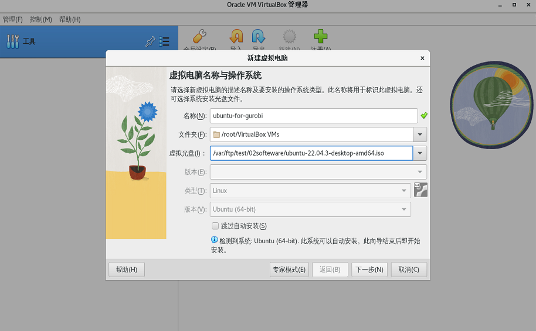
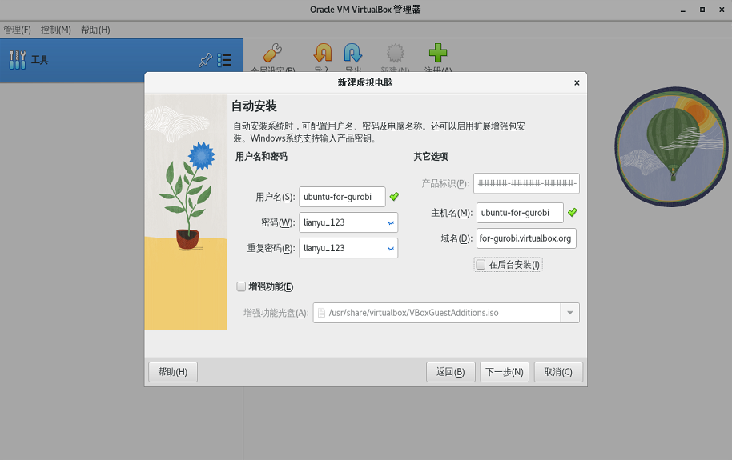
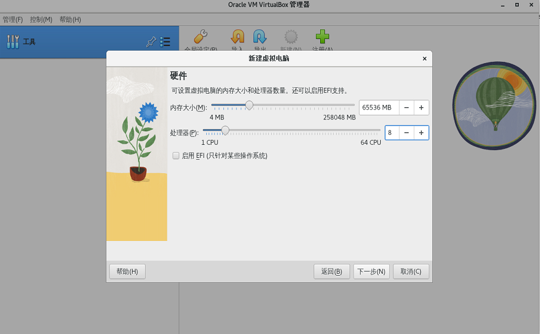
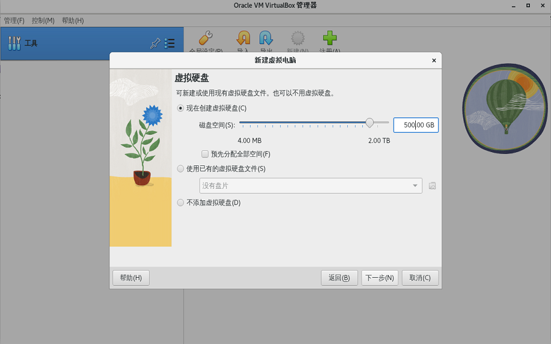
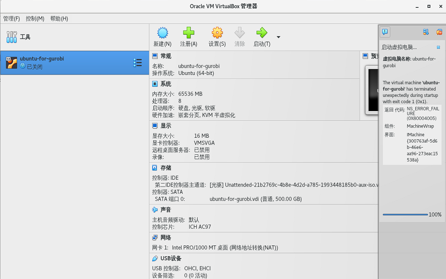
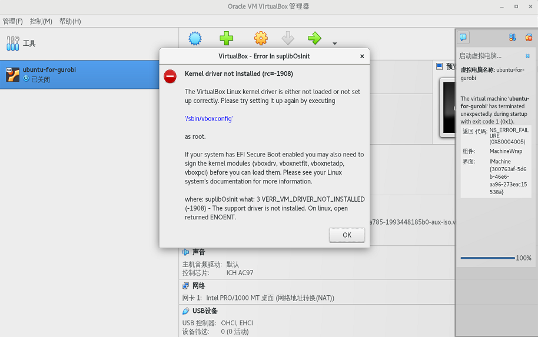

本文演示了如何在Linux（以CentOS 7为例）安装VirtualBox。

<!-- more -->


## 确认操作系统型号和版本

查看Linux内核版本：

```
[root@localhost ~]# uname -a
Linux localhost.localdomain 3.10.0-1160.71.1.el7.x86_64 #1 SMP Tue Jun 28 15:37:28 UTC 2022 x86_64 x86_64 x86_64 GNU/Linux
```

查看Linux发行版本：

```
[root@localhost ~]# cat /etc/os-release
NAME="CentOS Linux"
VERSION="7 (Core)"
ID="centos"
ID_LIKE="rhel fedora"
VERSION_ID="7"
PRETTY_NAME="CentOS Linux 7 (Core)"
ANSI_COLOR="0;31"
CPE_NAME="cpe:/o:centos:centos:7"
HOME_URL="https://www.centos.org/"
BUG_REPORT_URL="https://bugs.centos.org/"

CENTOS_MANTISBT_PROJECT="CentOS-7"
CENTOS_MANTISBT_PROJECT_VERSION="7"
REDHAT_SUPPORT_PRODUCT="centos"
REDHAT_SUPPORT_PRODUCT_VERSION="7"
```

本例为CentOS 7。


## 添加密钥

执行如下命令来下载并导入密钥：


```
[root@localhost ~]# sudo wget -q https://www.virtualbox.org/download/oracle_vbox_2016.asc

[root@localhost ~]# sudo rpm --import oracle_vbox_2016.asc
```

添加源

```
[root@localhost ~]# sudo wget https://download.virtualbox.org/virtualbox/rpm/el/virtualbox.repo -P /etc/yum.repos.d
```


## 执行安装

```
[root@localhost ~]# yum install VirtualBox-7.0
```


## 安装VirtualBox Extension Pack

VirtualBox Extension Pack为客户机提供了一些有用的功能，例如虚拟USB 2.0和3.0设备，支持RDP，镜像加密等。

下载扩展包

```
[root@localhost ~]# sudo wget https://download.virtualbox.org/virtualbox/7.0.12/Oracle_VM_VirtualBox_Extension_Pack-7.0.12.vbox-extpack
```

安装扩展包

```
[root@localhost ~]# sudo VBoxManage extpack install Oracle_VM_VirtualBox_Extension_Pack-7.0.12.vbox-extpack
```


## 启动 VirtualBox

现在你 VirtualBox 已经被安装在 你的 CentOS 机器上了，你可以通过下面的方式启动它：


* 在命令行输入VirtualBox
* 点击 VirtualBox 图标启动

 

## 通过VirtualBox安装虚拟机（Ubuntu）

提前准备好Ubuntu的ISO文件。当 VirtualBox启动后，创建虚拟机如下：





设置用户、密码





分配内存、CPU



分配硬盘
 



创建完成
 



## 设置远程桌面
 
 


安装Xrdp

```
[root@localhost ~]# yum -y install xrdp
```


如果提示没有可用的软件包，需要安装EPEL


```
yum -y install epel-release
```


启动xrdp


安装完成之后，设置开机启动并启动xrdp

```
[root@localhost ~]# systemctl start xrdp && systemctl enable xrdp
```
 
运行下面的命令，将xrdp用户添加到这个用户组：

```
sudo adduser xrdp ssl-cert
```

重启 Xrdp 服务，使得修改生效：

```
sudo systemctl restart xrdp
```


开放防火墙

```
sudo ufw allow 3389
```


## 相关问题


### Kernel driver not installed (rc=-1908)


 
```
Kernel driver not installed (rc=-1908)

The VirtualBox Linux kernel driver is either not loaded or not set up correctly. Please try setting it up again by executing

'/sbin/vboxconfig'

as root.

If your system has EFI Secure Boot enabled you may also need to sign the kernel modules (vboxdrv, vboxnetflt, vboxnetadp, vboxpci) before you can load them. Please see your Linux system's documentation for more information.

where: suplibOsInit what: 3 VERR_VM_DRIVER_NOT_INSTALLED (-1908) - The support driver is not installed. On linux, open returned ENOENT.
```




大概意思就是内核驱动没有安装，下面推荐了一个指令可以安装：


```
[root@localhost /]# sudo /sbin/vboxconfig
```

上述命令执行过程中，可能存在如下错误

```
vboxdrv.sh: Stopping VirtualBox services.
vboxdrv.sh: Starting VirtualBox services.
vboxdrv.sh: Building VirtualBox kernel modules.
This system is currently not set up to build kernel modules.
Please install the gcc make perl packages from your distribution.
Please install the Linux kernel "header" files matching the current kernel
for adding new hardware support to the system.
The distribution packages containing the headers are probably:
    kernel-devel kernel-devel-3.10.0-1160.71.1.el7.x86_64
This system is currently not set up to build kernel modules.
Please install the gcc make perl packages from your distribution.
Please install the Linux kernel "header" files matching the current kernel
for adding new hardware support to the system.
The distribution packages containing the headers are probably:
    kernel-devel kernel-devel-3.10.0-1160.71.1.el7.x86_64

There were problems setting up VirtualBox.  To re-start the set-up process, run
  /sbin/vboxconfig
as root.  If your system is using EFI Secure Boot you may need to sign the
kernel modules (vboxdrv, vboxnetflt, vboxnetadp, vboxpci) before you can load
them. Please see your Linux system's documentation for more information.
```

上述结果提示还需要继续安装相关的程序：


```
[root@localhost /]# yum install gcc-c++        

[root@localhost /]# sudo yum install kernel-devel      

[root@localhost /]# sudo yum update kernel  
```

更新完之后，需要重启系统选择最新的内核。


再次执行以下命令：

```
[root@localhost ~]# sudo /sbin/vboxconfig                                                                  
vboxdrv.sh: Stopping VirtualBox services.                                                                  
vboxdrv.sh: Starting VirtualBox services.                                                                  
vboxdrv.sh: Building VirtualBox kernel modules.
```


## 参考

* <https://github.com/neutrinolabs/xrdp>

