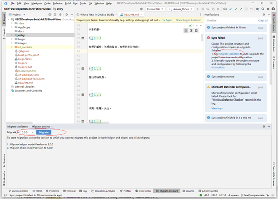
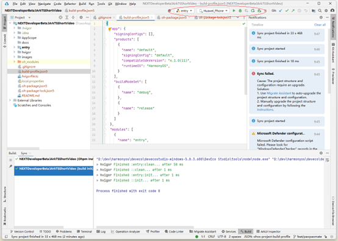

DevEco Studio从NEXT Developer Beta3版本开始，提供开箱即用的开发体验，将SDK、Node.js、Hvigor、OHPM等工具链进行合一打包，简化DevEco Studio安装配置流程，并提供一体化的历史工程迁移能力，帮助开发者快速完成工程转换。

<!-- more -->

## 问题背景

比如，我们在 “鸿蒙零基础快速实战-仿抖音App开发（ArkTS版）”（<https://coding.imooc.com/class/843.html>）视频课程中，因为讲师在该课程授课时是使用的HarmonyOS 3.1/4.0应用（API 9），如果部分学员采用了最新的HarmonyOS NEXT API，此时就会遇到API兼容性的问题。

可以先参考：《HarmonyOS 3.1/4.0应用升级到HarmonyOS NEXT改动点》（<https://waylau.com/changes-upgrade-from-3-1-4-0-to-harmonyos-next-developer-preview2/>）这篇文章，将应用升级到HarmonyOS NEXT API。

但是DevEco Studio NEXT Developer Beta3如果打开HarmonyOS NEXT Developer Preview2应用报错问题，解决方式就借助于Migrate Assistant，自动升级到NEXT Developer Beta3版本。

## 自动迁移

打开历史工程，Notifications通知栏将出现“Sync failed.”同步失败提示，点击Migrate Assistant，进入迁移助手页面。

在页面下方的Migrate Assistant页签中选择迁移到5.0.0，并点击Migrate按钮，此时将出现弹窗提示开发者进行数据备份。若确认已完成备份，请点击弹窗中Migrate，启动迁移任务。

待工程重新完成同步，并无其他报错提示，即为迁移成功。

可以看到，在模拟器里面也能正常运行应用了。

## 参考资料

* 本文同步至：<https://waylau.com/install-deveco-studio-cangjie-plugin/>
* 《跟老卫学HarmonyOS开发》 开源免费教程，<https://github.com/waylau/harmonyos-tutorial>
* 《跟老卫学仓颉编程语言开发》 开源免费教程，<https://github.com/waylau/cangjie-programming-language-tutorial>
* 《鸿蒙HarmonyOS手机应用开发实战》（清华大学出版社）
* 《鸿蒙HarmonyOS应用开发从入门到精通战》（北京大学出版社）
* “鸿蒙系统实战短视频App 从0到1掌握HarmonyOS”（<https://coding.imooc.com/class/674.html>）
* 《鸿蒙HarmonyOS应用开发入门》（清华大学出版社）
* “鸿蒙零基础快速实战-仿抖音App开发（ArkTS版）”（<https://coding.imooc.com/class/843.html>）