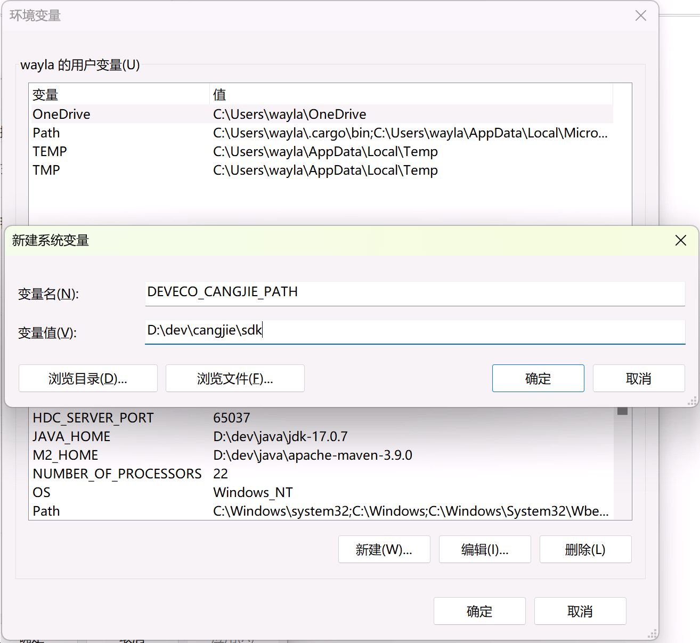
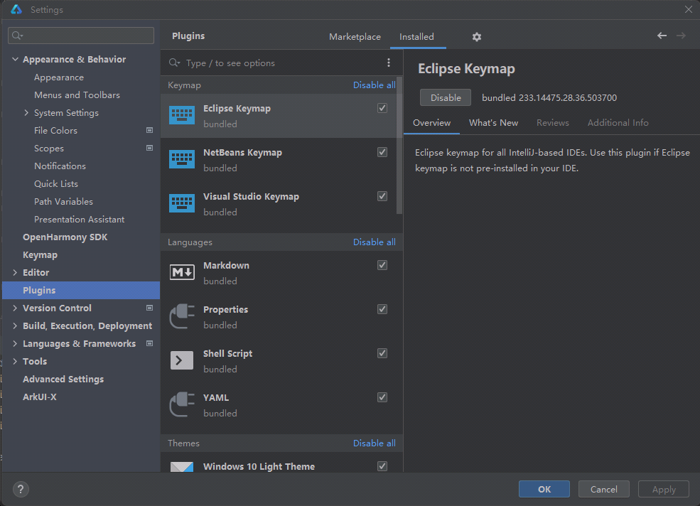
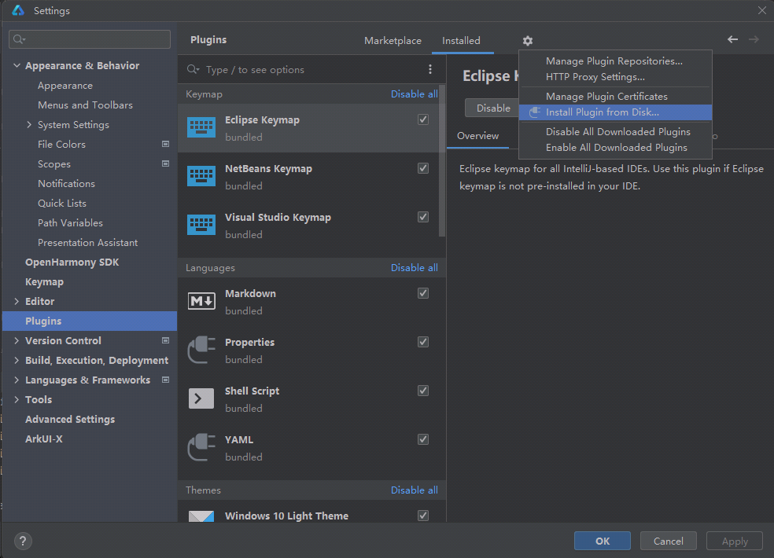
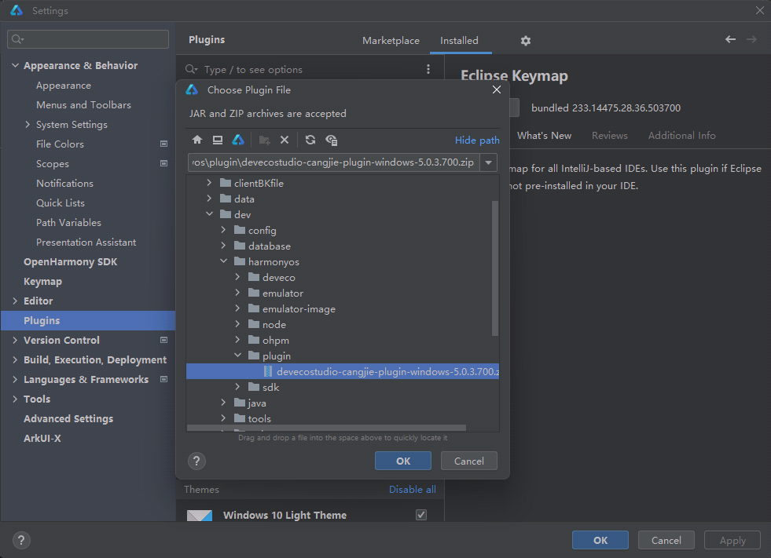
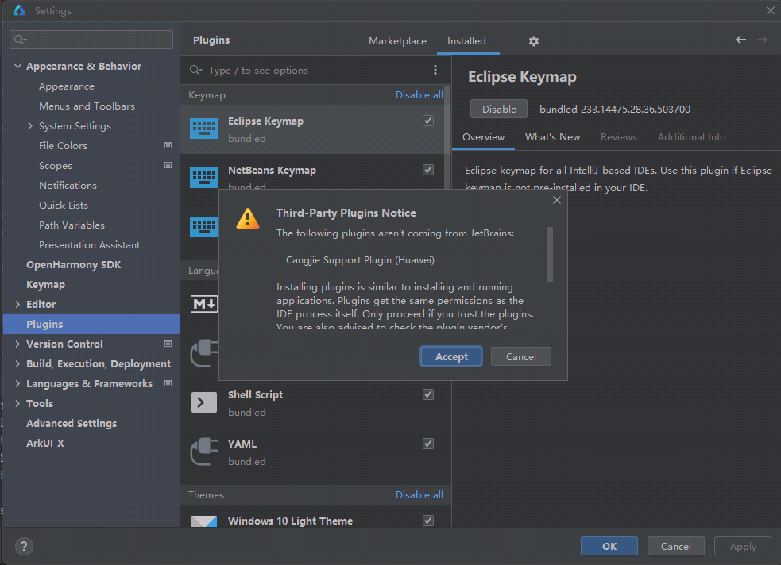
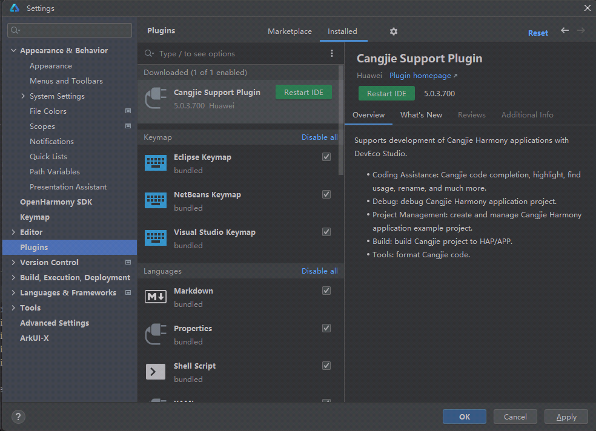

仓颉编程语言开发环境搭建主要是两部分：

* 安装最新版DevEco Studio；
* 在DevEco Studio里面安装仓颉插件（DevEco Studio Cangjie Plugin）。

本文主要介绍DevEco Studio Cangjie Plugin的使用。


<!-- more -->


## DevEco Studio Cangjie Plugin概述


DevEco Studio Cangjie Plugin配套DevEco Studio发布，该插件提供了仓颉编程语言在HarmonyOS Next应用开发的开发套件，包括代码编辑、编译构建、代码调试等能力。

DevEco Studio Cangjie Plugin目前支持以下三个平台：

* Windows (64-bit)
* Mac (X86)
* Mac (ARM)

DevEco Studio Cangjie Plugin下载地址为：https://developer.huawei.com/consumer/cn/download/

下载完成之后，会得到一个devecostudio-cangjie-plugin-windows-5.0.3.700.zip插件装包。


## 设置安装目录


如需指定仓颉SDK的存放路径，请在安装插件前配置系统环境变量，变量名为“DEVECO_CANGJIE_PATH”，变量值为要存放的路径。配置完系统环境变量后，DevEco Studio需要关闭再打开，环境变量才会生效。




如果不指定仓颉SDK的存放路径，仓颉SDK存放的默认路径在 macOS 系统下默认为 `$HOME/.cangjie-sdk`，windows 下默认为 `%USERPROFILE%/.cangjie-sdk`。

## 安装本地插件

打开“File > Settings > Plugins”页面



点击齿轮图标，选择“Install Plugin from Disk”



选择下载好的仓颉插件装包。



点击Accept接受安装。



完成安装后会提示 Restart IDE，点击 Restart IDE 按钮重启，完成插件安装





## 验证

仓颉SDK目录下，会有一个仓颉编译器，执行“cjc -v”来验证安装是否完成：

```
D:\dev\cangjie\sdk\.cangjie-sdk\5.0\cangjie\compiler\bin>cjc -v
Cangjie Compiler: 0.53.8 (cjnative)
Target: x86_64-w64-mingw32
```

## 参考资料


* 本文同步至：<https://waylau.com/install-deveco-studio-cangjie-plugin/>
* 《跟老卫学HarmonyOS开发》 开源免费教程，<https://github.com/waylau/harmonyos-tutorial>
* 《鸿蒙HarmonyOS手机应用开发实战》（清华大学出版社）
* 《鸿蒙HarmonyOS应用开发从入门到精通战》（北京大学出版社）
* “鸿蒙系统实战短视频App 从0到1掌握HarmonyOS”（<https://coding.imooc.com/class/674.html>）
* 《鸿蒙HarmonyOS应用开发入门》（清华大学出版社）
* “鸿蒙零基础快速实战-仿抖音App开发（ArkTS版）”（<https://coding.imooc.com/class/843.html>）