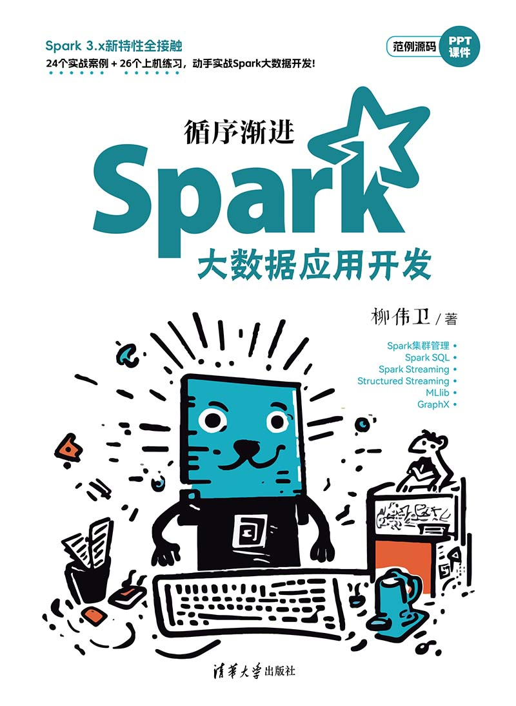
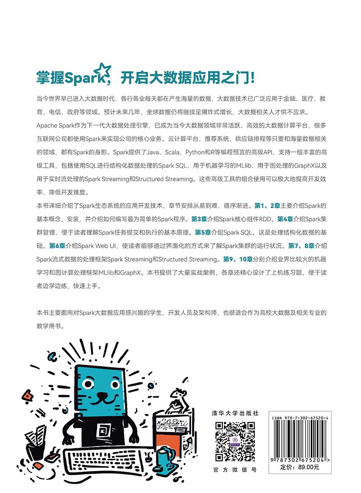

《循序渐进Spark大数据应用开发》由清华大学出版社出版，已于近期上市。该书基于Spark 3.5.1编写，提供24个实战案例+26个上机练习，可谓是目前市面上最新的Spark力作。

本文对《循序渐进Spark大数据应用开发》一书做个大致的介绍。

<!-- more -->

## 封面部分

首先是介绍封面部分。

《循序渐进Spark大数据应用开发》封面部分是采用了比较Q的风格设计，充满活力。

可以看到，左上角和右上角体现了本书的特色，案例丰富，同时也提供了源码和教学课件。

底部是出版社“清华大学出版社”字样。

## 封底部分

介绍封底部分。

封底部分可以看到主要是对本书的简介。

本书主要是面向对Spark大数据应用感兴趣的学生、开发人员及架构师，也适合培作为高校大数据及相关专业的教学用书。

全书篇幅274页，定价为89元，也算良心了。极具性价比。

## 内容简介

《循序渐进Spark大数据应用开发》结合作者一线开发实践，循序渐进地介绍了新版Apache Spark 3.x的开发技术。全书共10章，第1章和第2章主要介绍Spark的基本概念、安装，并演示如何编写最简单的Spark程序。第3章深入探讨了Spark的核心组件RDD。第4章讲解了Spark集群管理，帮助读者理解任务提交与执行的基本原理。第5章介绍了Spark SQL，这是处理结构化数据的基础工具。第6章展示了Spark Web UI，通过界面化的方式了解Spark集群运行状况。第7章和第8章分别介绍了Spark流式数据处理框架Spark Streaming和Structured Streaming。第9章和第10章则分别介绍了业界流行的机器学习和图计算处理框架MLlib和GraphX。书中各章节还提供了丰富的实战案例和上机练习题，以便读者在学习的同时进行实际操作，迅速提升动手能力。
《循序渐进Spark大数据应用开发》技术先进，案例丰富，适合对Spark大数据应用感兴趣的学生、大数据开发人员及架构师使用，也可作为培训机构和高校大数据课程的教学用书。

《循序渐进Spark大数据应用开发》是一本深入浅出的Spark大数据开发实战指南，专为希望掌握Apache Spark 3.x技术栈的开发者量身定制。《循序渐进Spark大数据应用开发》不仅涵盖了Spark的基础概念和安装步骤，更通过丰富的实战案例和上机练习，引导读者逐步深入理解并掌握Spark的核心组件、集群管理、SQL处理、流式数据处理以及机器学习与图计算等高级功能。
作者凭借一线开发经验，精心编排了10个章节的内容，确保读者能够循序渐进地学习Spark的各项关键技术。从最简单的Spark程序编写开始，逐步过渡到复杂的数据处理和分析任务，每一章都充满了实用价值和操作指导。

特别值得一提的是，《循序渐进Spark大数据应用开发》提供了24个精心设计的实战案例和26个上机练习题，这些内容旨在帮助读者将理论知识转化为实践技能，快速提升解决实际问题的能力。无论是对于学生、大数据开发人员还是架构师来说，这都是一本不可多得的宝贵资源。

## 写作背景

笔者在华为技术有限公司担任架构师期间，主导过MetaERP项目高级调度系统计算引擎的自研。在这期间，笔者也大规模使用了Spark平台作为分布式计算的底座，因此积累了大量Spark的使用经验。同时，笔者在业余时间撰写和分享了大量有关Spark的技术博客，这些技术博客都被汇总到了我的开源电子书《跟老卫学Apache Spark开发》。《跟老卫学Apache Spark开发》是一本Spark应用开发的开源学习教程，主要介绍如何从0开始开发Spark应用。

本书在《跟老卫学Apache Spark开发》基础之上，做了补充和完善，加入了大量当前Spark最新的特性以及案例。希望帮助读者轻松入门Spark。

## 配套资源

本书提供的素材和源代码可从以下网址下载：

<https://github.com/waylau/apache-spark-tutorial>

## 勘误和交流

本书如有勘误，会在以下网址发布：
<https://github.com/waylau/apache-spark-tutorial/issues>

## 视频介绍

见B站：<https://www.bilibili.com/video/BV1Uhm1YKEdb/>

## 配套书籍、课程

如果你喜欢本开源书，也欢迎支持下该书的正式出版物，实体店及各大网店有售。

* [京东](https://search.jd.com/Search?keyword=%E5%BE%AA%E5%BA%8F%E6%B8%90%E8%BF%9BSpark%E5%A4%A7%E6%95%B0%E6%8D%AE%E5%BA%94%E7%94%A8%E5%BC%80%E5%8F%91&enc=utf-8&wq=%E5%BE%AA%E5%BA%8F%E6%B8%90%E8%BF%9BSpark%E5%A4%A7%E6%95%B0%E6%8D%AE%E5%BA%94%E7%94%A8%E5%BC%80%E5%8F%91&pvid=32d2112ca641476d9fc5323cf6113f60)
* [当当](https://search.jd.com/Search?keyword=%E5%BE%AA%E5%BA%8F%E6%B8%90%E8%BF%9BSpark%E5%A4%A7%E6%95%B0%E6%8D%AE%E5%BA%94%E7%94%A8%E5%BC%80%E5%8F%91&enc=utf-8&wq=%E5%BE%AA%E5%BA%8F%E6%B8%90%E8%BF%9BSpark%E5%A4%A7%E6%95%B0%E6%8D%AE%E5%BA%94%E7%94%A8%E5%BC%80%E5%8F%91&pvid=90f7a002994847d08196d4d3e77761a1)

## 参考引用

* 原文同步至：<https://waylau.com/about-spark-tutorial-book/>
* 《跟老卫学Apache Spark开发》：<https://github.com/waylau/apache-spark-tutorial>