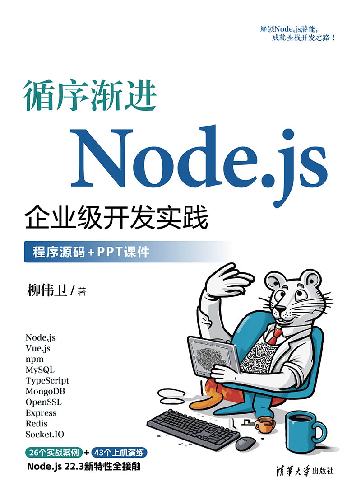
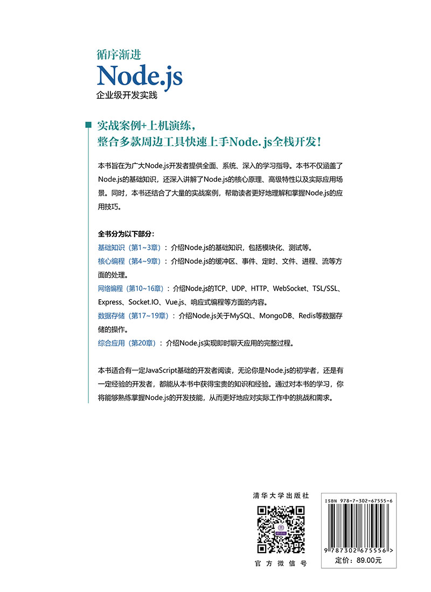

《循序渐进Node.js企业级开发实践》由清华大学出版社出版，已于近期上市。该书基于Node.js 22.3.0编写，提供26个实战案例+43个上机练习，可谓是目前市面上最新的Node.js力作。

本文对《循序渐进Node.js企业级开发实践》一书做个大致的介绍。

<!-- more -->

## 封面部分

首先是介绍封面部分。

《循序渐进Node.js企业级开发实践》跟我之前所介绍的《[循序渐进Spark大数据应用开发](https://waylau.com/about-spark-tutorial-book/)》是属于同一系列的作品，封面部分保持了一贯的比较Q的风格设计，充满活力。

可以看到，左下角和右上角体现了本书特色。本书目标是“解锁Node.js潜能，成就全栈开发之路！”。同时本书案例丰富，提供26个实战案例+43个上机练习。

为了方便各大院校师生教学使用，本书也提供了源码和教学课件。

右下角是出版社“清华大学出版社”字样。

## 封底部分

介绍封底部分。

封底部分可以看到主要是对本书的简介。

本书主要是面向对Node.js应用开发感兴趣的学生、开发人员及架构师，也适合培作为高校大数据及相关专业的教学用书。

* Node.js初学者：本书从基础知识开始，逐步深入到核心编程、网络编程和数据存储等高级主题，适合零基础或刚开始接触Node.js的开发者。
* 进阶开发者：对于已经有一定Node.js开发经验的开发者，书中的核心编程和网络编程部分提供了更深入的技术细节和实战案例，能帮助开发者提升技能水平，解决实际工作中遇到的复杂问题。
* 全栈工程师：本书不仅涵盖了Node.js后端技术，还涉及了前端框架Vue.js的应用，以及即时聊天应用的综合实践。这使得全栈工程师可以通过一本书全面了解前后端技术的结合，提升整体开发能力。
* 高校学生与教师：本书理论与实践相结合，并提供了大量上机练习题，很适合作为高校计算机相关专业的教学用书。教师可以根据书中的内容设计课程，学生则可以通过实际操作加深理解，提高动手能力。
* 培训机构学员：对于参加Node.js培训的学员来说，本书是一本理想的教材。书中的实战案例和上机练习可以帮助学员更好地理解和掌握所学知识，提高培训效果。

全书篇幅317页，定价为89元，也算良心了。极具性价比。

## 内容简介

《循序渐进Node.js企业级开发实践》结合作者多年一线开发实践，系统地介绍了Node.js技术栈及其在企业级开发中的应用。全书共分5部分，第1部分基础知识（第1～3章），介绍Node.js的基础知识，包括模块化、测试等；第2部分核心编程（第4～9章），介绍Node.js的缓冲区、事件、定时、文件、进程、流等方面的处理；第3部分网络编程（第10～16章），介绍Node.js的TCP、UDP、HTTP、WebSocket、TSL/SSL、常用Web中间件、Vue.js与响应式编程等方面的内容；第4部分数据存储（第17～19章），介绍Node.js关于MySQL、MongoDB、Redis等数据存储的操作；第5部分综合应用（第20章），介绍Node.js实现即时聊天应用的完整过程。除了Node.js技术外，本书还讲述了Express、Socket.IO、Vue.js、MySQL、MongoDB、Redis等热门技术的应用。本节还精心设计了26个实战案例和43个上机练习，所有练习都提供了操作步骤，便于读者实操演练，快速上手。

《循序渐进Node.js企业级开发实践》技术新颖，实例丰富，理论讲解与代码实现相结合，既适合作为Node.js的初学者和进阶读者的自学用书，也适合作为培训机构或高校相关专业的教学用书。

全书分为以下5部分：

* 基础知识（第1～3章）：介绍Node.js的基础知识，包括模块化、测试等。
* 核心编程（第4～9章）：介绍Node.js的缓冲区、事件、定时、文件、进程、流等方面的处理。
* 网络编程（第10～16章）：介绍Node.js的TCP、UDP、HTTP、WebSocket、TSL/SSL、常用Web中间件、Vue.js与响应式编程等方面的内容。
* 数据存储（第17～19章）：介绍Node.js关于MySQL、MongoDB、Redis等数据存储的操作。
* 综合应用（第20章）：介绍Node.js实现即时聊天应用的完整过程。

值得注意的是，本书精心设计了26个实战案例和43个上机练习，每个上机练习均给出了操作步骤和示例代码，便于读者边学边练，快速上手。这些内容旨在帮助读者将理论知识转化为实践技能，快速提升解决实际问题的能力。无论是对于学生、大数据开发人员还是架构师来说，这都是一本不可多得的宝贵资源。

## 写作背景

Node.js作为一款高性能、开源的服务器端JavaScript运行环境，自2009年诞生以来，凭借其非阻塞I/O模型、事件驱动、单线程等特性，在实时应用、高并发场景以及前后端分离的架构中得到了广泛应用。同时，随着前端技术的不断进化，如React、Vue等框架的兴起，全栈开发的概念逐渐被更多的开发者接受。Node.js作为全栈开发的重要一环，其重要性不言而喻。

近年来，随着云计算、大数据、人工智能等技术的融合发展，Node.js的应用场景也在不断扩展，从最初的Web开发逐渐延伸到物联网、移动应用、实时通信、游戏开发等多个领域。因此，对于广大开发者来说，掌握Node.js已经成为必备的技能之一。

本书旨在为广大Node.js开发者提供一本全面、系统、深入的学习指南。本书不仅涵盖了Node.js的基础知识，还深入讲解了Node.js的核心原理、高级特性以及实际应用场景。同时，本书还结合了大量的实战案例，帮助读者更好地理解和掌握Node.js的全栈开发技巧。

## 配套资源

本书提供的素材和源代码可从以下网址下载：

<https://github.com/waylau/nodejs-book-samples>

## 勘误和交流

本书如有勘误，会在以下网址发布：
<https://github.com/waylau/nodejs-book-samples/issues>

## 视频介绍

见B站：<https://www.bilibili.com/video/BV1NrqLYQEi4/>

## 配套书籍、课程

如果你喜欢本开源书，也欢迎支持下该书的正式出版物，实体店及各大网店有售。

* [京东](https://re.jd.com/search?keyword=%E5%BE%AA%E5%BA%8F%E6%B8%90%E8%BF%9BNode.js%E4%BC%81%E4%B8%9A%E7%BA%A7%E5%BC%80%E5%8F%91%E5%AE%9E%E8%B7%B5&enc=utf-8)
* [当当](https://search.dangdang.com/?key=%D1%AD%D0%F2%BD%A5%BD%F8Node.js%C6%F3%D2%B5%BC%B6%BF%AA%B7%A2%CA%B5%BC%F9&act=input)

## 参考引用

* 原文同步至：<https://waylau.com/about-progressive-nodejs-enterprise-level-application-practice-book/>
* 《Node.js 案例大全》：<https://github.com/waylau/nodejs-book-samples>