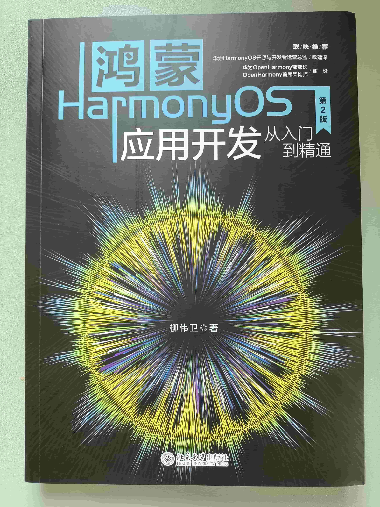
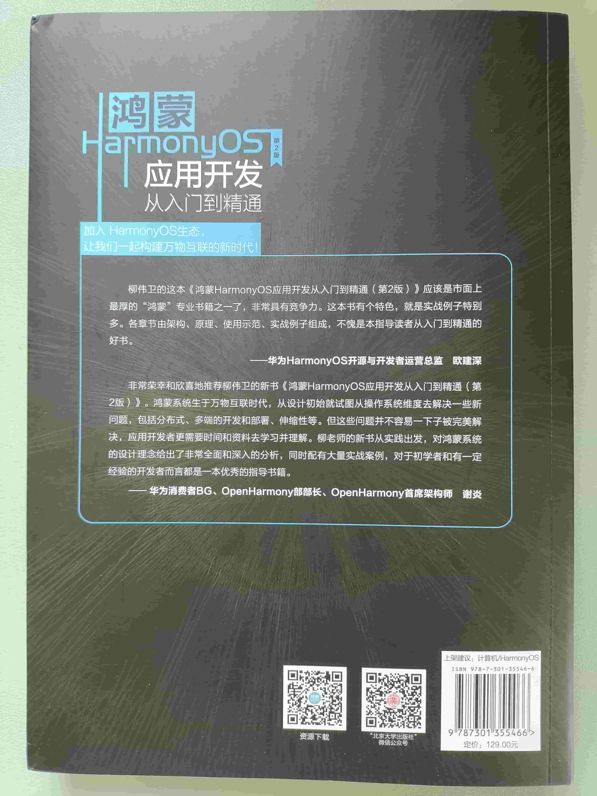

《鸿蒙HarmonyOS应用开发从入门到精通（第2版）》已于近日上市，该书由北京大学出版社出版。距离[第1版](https://waylau.com/about-harmonyos-application-development-from-zero-to-hero-book/)上市已经过去二年半多。本文希望与读者朋友们分享下这本书里面的大致内容。

<!-- more -->

## 封面部分

首先是介绍封面部分。

《鸿蒙HarmonyOS应用开发从入门到精通（第2版）》封面部分延续了第一版全黑设计，富有科技感和神秘感。

中部是个类似于黑洞或者瞳孔图样，寓意着活力或者张力吧。

上书蓝色“鸿蒙HarmonyOS”两字，这个配色还是具有非常高的辨识度的。下面的英文“HarmonyOS”中的“r”处理的看着夸张，实际上是为了把下面中文给框住，呈现出主次分明的设计感。

可以看到，底部是出版社“北京大学出版社”字样。

整体来说，这个封面相对高级，设计走的一贯的黑色风格。蓝、黑、白三色搭配还是比好看。

## 封底部分

介绍封底部分。

封底部分可以看到是两位重量级华为大咖背书，而且都是鸿蒙团队核心人员。

这本书归类为计算机/HarmonyOS。

全书589页，比较厚，内容比较全面，定价为129元，也算良心了。极具性价比。

## 内容简介

华为自主研发的HarmonyOS（鸿蒙系统）是一款面向未来、面向全场景（移动办公、运动健康、社交通信、媒体娱乐等）的分布式操作系统。本书采用HarmonyOS最新版本作为基石，详细介绍如何基于HarmonyOS进行应用的开发，包括HarmonyOS架构、DevEco Studio、应用结构、Ability、安全管理、公共事件、通知、Java UI、ArkTS、ArkUI、Stage模型、设备管理、数据管理、线程管理、视频、图像、网络管理等多个主题。本书辅以大量的实战案例，图文并茂，使读者易于理解和掌握。同时，本书的案例选型偏重于解决实际问题，具有很强的前瞻性、应用性和趣味性。加入HarmonyOS生态，让我们一起构建万物互联的新时代！

本书主要面向的是对HarmonyOS应用开发感兴趣的学生、开发人员、架构师。

## 写作背景

中国信息产业一直是“缺芯少魂”，其中的“芯”指的是芯片，而“魂”则是指操作系统。而自2019年5月15日起，美国陆续把包括华为在内中国高科技企业列入其所谓的“实体清单”（Entities List），标志着科技再次成为中美博弈的核心领域。

随着谷歌暂停与华为的部分合作，包括软件和技术服务的转让。华为在国外市场已经面临着升级Android版本、搭载谷歌服务等方面遇到困境。在这样的背景下，华为顺势推出HarmonyOS，以求在操作系统领域不被受制于人。

HarmonyOS是一款“面向未来”、面向全场景（移动办公、运动健康、社交通信、媒体娱乐等）的全新的分布式操作系统。作为操作系统领域的新成员，HarmonyOS势必会面临着bug多、学习资源缺乏等众多困难。为此，笔者在开源社区，以开源方式推出了免费系列学习教程《跟老卫学HarmonyOS开发》（<https://github.com/waylau/harmonyos-tutorial>），以帮助HarmonyOS爱好者入门。同时，为了让更多的人了解并使用HarmonyOS，笔者将自身工作、学习中遇到的问题、难题进行了总结，形成了本书，以补市场空白。

距离《鸿蒙HarmonyOS应用开发从入门到精通》2022年4月第1版已逾两载。热心的读者对于本书也投以了极大的关注，伴随着本书的成长，提了很多中肯的建议。对于这些意见，不管褒贬，一并全收，于是才有了第2版的可能。

对于技术型的书籍创作，笔者更加倾向于采用当今软件开发主流的方式——敏捷。敏捷写作打通了编写、校稿、出版、发行的整个流程，让知识可以第一时间呈现给读者。读者在阅读本书之后，也可以及时对书中的内容进行反馈，从而帮助作者完善书中内容，最终形成了良好的反馈闭环。所以，第2版所更新的内容，应该正是读者所期待的。

由于近些年HarmonyOS版本迭代较快，发展迅猛，特别是HarmonyOS 3版本引入了ArkTS语言，产生了新的编程模式。因此，本书第2版修改篇幅较大，各章节都做了大幅度更新。完整的修改内容，可以参阅本书后面部分“附录B：本书1版与2版的差异对比”章节内容。

## 内容介绍

全书大致分为了3部分：

* 入门（1-4章）：介绍HarmonyOS的背景、开发环境搭建，并创建一个简单的HarmonyOS应用，介绍了应用结构。
* 进阶（5-15章）：介绍HarmonyOS的核心功能的开发，内容包括Ability、安全管理、公共事件、通知、Java UI、ArkTS、ArkUI、Stage模型、设备管理、数据管理、线程管理、视频、图像、网络管理等。
* 实战（16-19章）：演示HarmonyOS在各类场景下的综合实战案例。

本书主要面向的是对HarmonyOS应用开发感兴趣的学生、开发人员、架构师。

## 本书特点

### 1．内容全面，技术新颖

本书几乎囊括了HarmonyOS所涉及的知识点包括HarmonyOS架构、DevEco Studio、应用结构、Ability、安全管理、公共事件、通知、ArkTS、ArkUI、Stage模型、设备管理、数据管理、线程管理、视频、图像、网络管理等多个主题。方面的内容，并提供了针对各类场景下的综合实战案例，包括智能穿戴、智慧屏、手机等应用。技术前瞻，案例丰富。不管是编程初学者，还是编程高手，都能从本书中获益。本书可作为读者案头的工具书，随手翻阅。

### 2．图文并茂，代码精彩

基于最新HarmonyOS技术展开，手把手传授从入门到精通的诀窍！

在线提供的源代码紧跟版本迭代，目前已经更新到HarmonyOS NEXT（HarmonyOS 5）版本。不用担心知识点过时哦。

### 3．案例丰富，实战性强

本书提供了丰富的基于HarmonyOS技术点的实例68个，将理论讲解最终落实到代码实现上来。在掌握了基础之后，另外提供了4个综合性实战案例。这些案例从零开始，最终实现了一个完整的企业级应用，内容具有很高的应用价值和参考性。

### 4．附赠资源

本书提供了书中涉及的所有实例的源文件。读者可以一边阅读本书，一边参照源文件动手练习，这样不仅提高了学习的效率，而且可以对书中的内容有更加直观的认识，从而逐渐培养自己的编程能力。

## 源代码

本书提供的素材和源代码可从以下网址下载：
<https://github.com/waylau/harmonyos-tutorial>

## 勘误和交流

本书如有勘误，会在以下网址发布：
<https://github.com/waylau/harmonyos-tutorial/issues>

## 参考引用

* 原文同步至：<https://waylau.com/about-harmonyos-application-development-from-zero-to-hero-2nd-edition-book/>
* 视频介绍可见B站：<https://www.bilibili.com/video/BV1N2ktYeEBd/>
* [京东](https://item.jd.com/14349963.html)
* [当当](http://product.dangdang.com/29821274.html)