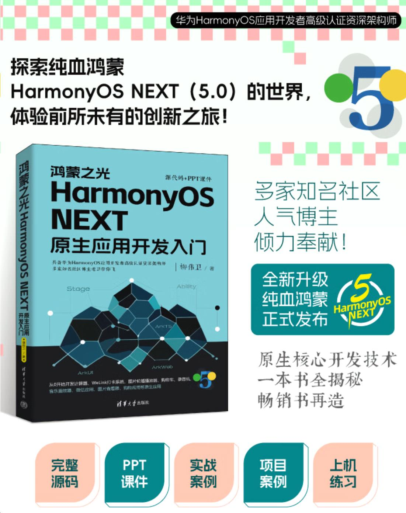
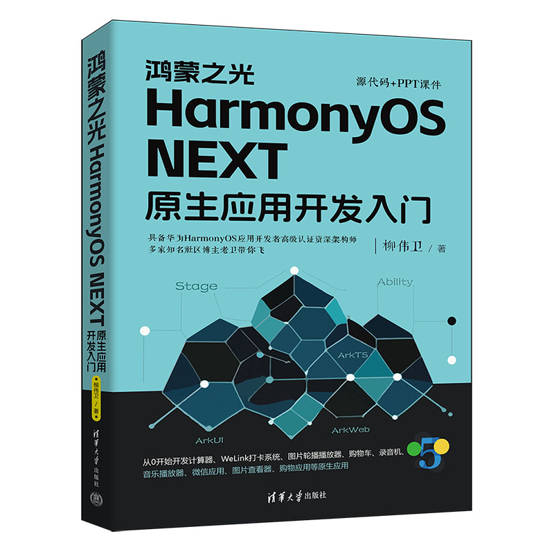
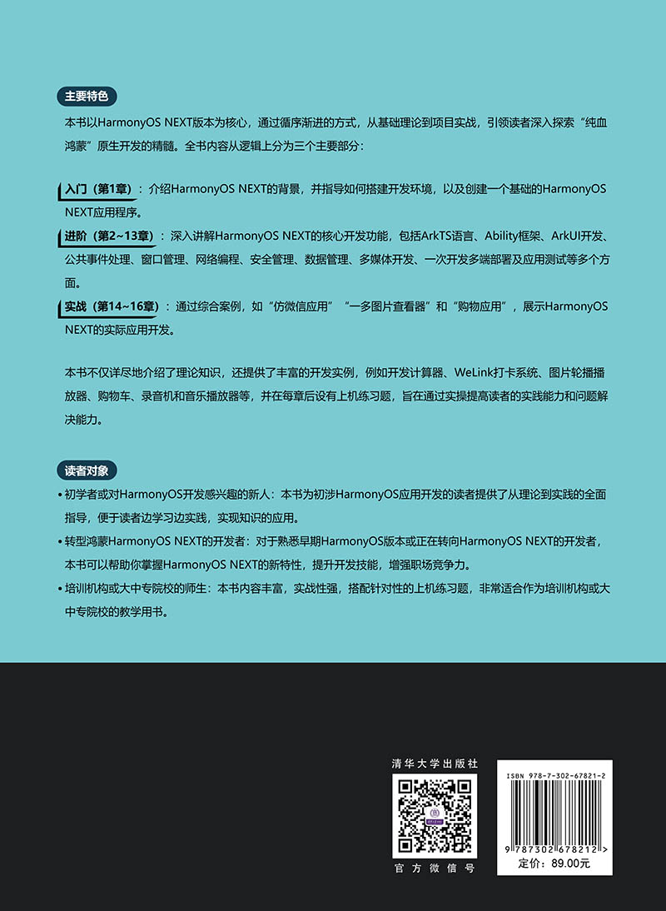
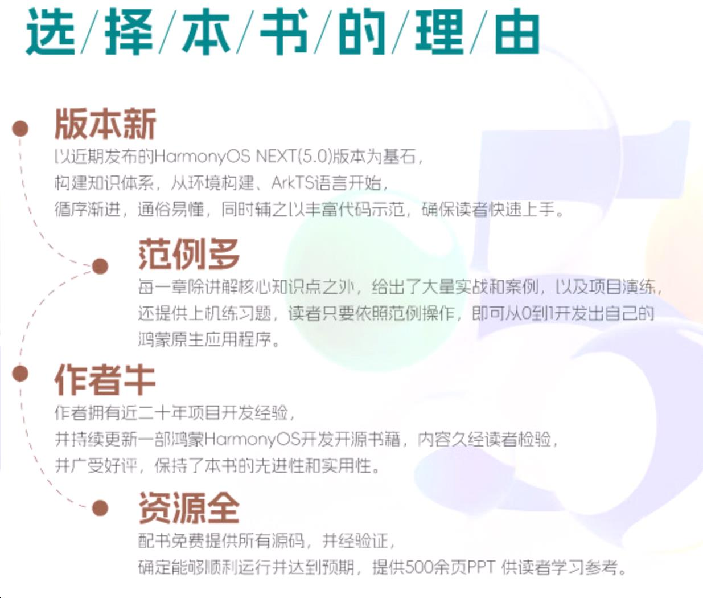

《鸿蒙之光HarmonyOS NEXT原生应用开发入门》已于近日上市，该书由清华大学出版社出版。该书可以理解为是[《鸿蒙HarmonyOS应用开发入门》](https://waylau.com/about-harmonyos-3-tutorial-book/)的更新版。本文希望与读者朋友们分享下这本书里面的大致内容。

<!-- more -->

## 封面部分

首先是介绍封面部分。

《鸿蒙之光HarmonyOS NEXT原生应用开发入门》封面部分暗黑系设计，富有科技感和神秘感。意味着通过“鸿蒙之光”来点亮未来的发展道路？

中部是个类似晶体结构，把几个重点的组件也展示了出来，包括ArkUI、ArkWeb、ArkTS、Stage、Ability，这些是整个HarmonyOS系统的构建系统的精华组件。

上书蓝色“HarmonyOS NEXT”大字，具有非常高的辨识度的，意味着这本书是重点基于HarmonyOS NEXT版本进行介绍的。

本书的右上角也体现了本书的一个特色，就是附赠完整的源代码和PPT课件，所有代码均经过严格测试验证，确保能够顺利运行并达到预期效果。

HarmonyOS NEXT也称为HarmonyOS 5，因此封面右下方有“5”的标识。

可以看到，底部是出版社“清华大学出版社”字样。

## 封底部分

介绍封底部分。

封底部分可以看到本书的内容介绍。《鸿蒙之光HarmonyOS NEXT原生应用开发入门》本书以HarmonyOS NEXT版本为核心，通过循序渐进的方式，从基础理论到项目实战，引领读者深入探索“纯血鸿蒙”原生开发的精髓。

本书不仅详细阐述了相关理论知识，还配合核心功能给出了诸多开发案例，如计算器开发、WeLink打卡系统、图片轮播播放器、购物车功能实现、录音机与音乐播放器创建等，还在各章安排了上机练习题，旨在通过实际操作提升读者的动手能力和解决实际问题的能力。

全书324页，获取适中，定价为89元，也不算贵，非常极具有性价比。

## 内容简介

《鸿蒙之光HarmonyOS NEXT原生应用开发入门》以HarmonyOS NEXT版本为核心，从基础知识到实战案例，引领读者逐步探索“纯血鸿蒙”原生开发的奥秘。全书共16章，内容涵盖HarmonyOS架构、DevEco Studio使用、应用结构解析、ArkTS编程语言、Ability组件、ArkUI开发、公共事件处理、窗口管理、网络编程、安全管理、数据管理、多媒体开发、多端部署及应用测试等关键主题。书中不仅详细阐述了相关理论知识，还结合了多个实战项目，如计算器开发、WeLink打卡系统、图片轮播播放器、购物车功能实现、录音机与音乐播放器创建、购物应用设计与微信应用模拟、图片查看器构建等，旨在通过实际操作提升读者的动手能力和解决实际问题的能力。

《鸿蒙之光HarmonyOS NEXT原生应用开发入门》技术新颖，案例丰富，突出实战，特别适合HarmonyOS应用开发初学者、爱好者和进阶者作为自学用书，也适合作为培训机构和大中专院校的教学用书。

## 写作背景

早在HarmonyOS NEXT正式发布之前，作者便已密切关注其发展路线图。在各大论坛，作者撰写了大量关于HarmonyOS NEXT新特性的文章，并进行技术布道。本书所选用的HarmonyOS NEXT版本是市面上首个正式版，具有重要的参考价值。

作者此前已出版多本专著，如《鸿蒙HarmonyOS手机应用开发实战》和《鸿蒙HarmonyOS应用开发从入门到精通》，并长期维护开源书《跟老卫学HarmonyOS开发》。因此，撰写本书并未遇到太多困难。本书聚焦于HarmonyOS NEXT版本的常用核心功能，这些功能均经过作者验证，确保可用性。其他非核心功能或存在bug的功能未收录本书，但会收入《跟老卫学HarmonyOS开发》并以开源方式不断演进。

## 内容介绍

全书内容从逻辑上分为三个主要部分：

* 入门（第1章）：介绍HarmonyOS NEXT的背景，并指导如何搭建开发环境，以及创建一个基础的HarmonyOS NEXT应用程序。
* 进阶（第2~13章）：深入讲解HarmonyOS NEXT的核心开发功能，包括ArkTS语言、Ability框架、ArkUI开发、公共事件处理、窗口管理、网络编程、安全管理、数据管理、多媒体开发、一次开发多端部署及应用测试等多个方面。
* 实战（第14~16章）：通过综合案例，如“仿微信应用”“一多图片查看器”和“购物应用”，展示HarmonyOS NEXT的实际应用开发。

本书主要面向的是对HarmonyOS应用开发感兴趣的学生、开发人员、架构师。

## 本书特点

《鸿蒙之光HarmonyOS NEXT原生应用开发入门》是一本全面介绍HarmonyOS NEXT版本开发的实战指南。无论你是对鸿蒙原生开发感兴趣的开发者，还是希望转型到HarmonyOSNEXT系统的资深工程师，这本书都能为你提供详尽而系统的指导。

### 内容详实，结构清晰

《鸿蒙之光HarmonyOS NEXT原生应用开发入门》从HarmonyOS NEXT的基础知识讲起，逐步深入到项目开发技巧。全书分为16章，涵盖了从环境搭建、ArkTS语言基础、UI开发、事件处理、窗口管理、网络编程、安全管理、数据管理、多媒体开发、多端部署到综合实战等多个方面。每一章节都配有详细的代码示例和上机练习，帮助你在实践中巩固所学知识。

### 前沿技术，紧跟潮流

书中详细介绍了HarmonyOS NEXT的新特性及其核心技术理念，让你能够紧跟华为领先的技术发展趋势。通过学习本书，你将掌握HarmonyOS NEXT的前沿技术，提升自己的开发能力。

### 实战导向，学以致用

《鸿蒙之光HarmonyOS NEXT原生应用开发入门》注重实战，每个章节都包含实战案例和上机练习，帮助你将理论知识应用到实际项目中。通过动手实践，你将学会如何创建第一个HarmonyOS NEXT应用，并逐步掌握复杂的开发技能。

### 综合实战，提升能力

书中提供了多个综合实战项目，包括仿微信应用、一多图片查看器和购物应用等，这些项目涵盖了不同的应用场景和技术点，帮助你全面提升开发能力。通过完成这些项目，你将积累宝贵的实践经验，为未来的开发工作打下坚实的基础。

### 专家撰写，质量保障

《鸿蒙之光HarmonyOS NEXT原生应用开发入门》由华为HarmonyOS NEXT应用开发高级认证资深架构师倾力打造，内容质量可靠。作者丰富的经验和深厚的技术功底，确保了本书的专业性和实用性。

无论你是初学者还是有经验的开发者，《鸿蒙之光HarmonyOS NEXT原生应用开发入门》都是你不可多得的学习资源。通过阅读《鸿蒙之光HarmonyOS NEXT原生应用开发入门》，你将开启鸿蒙原生开发的新篇章，成为未来科技的先锋！

## 源代码

本书提供的素材和源代码可从以下网址下载：
<https://github.com/waylau/harmonyos-tutorial>

## 勘误和交流

本书如有勘误，会在以下网址发布：
<https://github.com/waylau/harmonyos-tutorial/issues>

## 参考引用

* 原文同步至：<https://waylau.com/about-harmonyos-next-tutorial-book/>
* 视频介绍可见B站：<https://www.bilibili.com/video/BV11cCpYXEyL/>
* [京东](https://item.jd.com/14905890.html)
* [当当](https://product.dangdang.com/29832721.html)