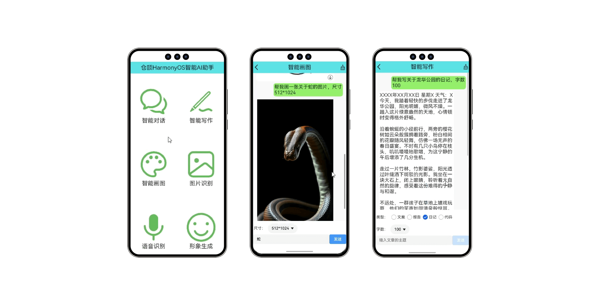
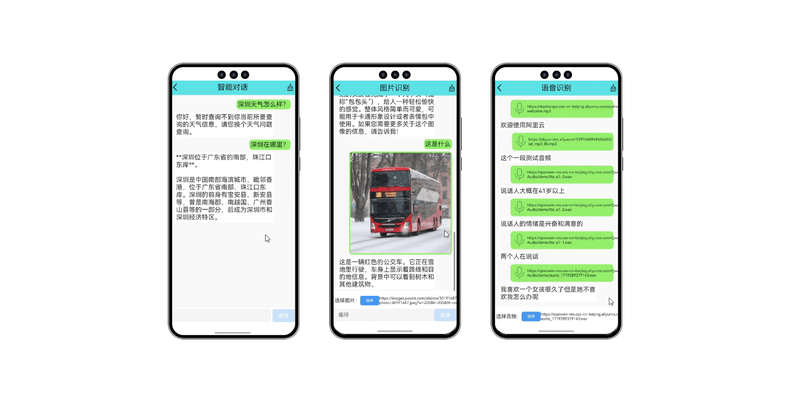

仓颉开发原生鸿蒙HarmonyOS智能AI助手实战课程“AI智能助手APP全流程开发实战”已经于今日上线至慕课网（<https://coding.imooc.com/class/927.html>），有致力于鸿蒙生态开发的同学们可以关注一下。

<!-- more -->

## 课程简介

如果你想在大学竞赛，毕设，实习面试中脱颖而出，那学会开发一款高质量的AI智能应用APP是一个很不错的选择；如果你想从事AI智能应用开发，但缺乏对应的开发技能和完整流程指导，自己上手问题重重，无从下手？别担心，这门课程为你量身打造！本课程将从0到1带你开发一套AI智能助手APP，项目覆盖6大AI核心业务，包括：智能对话/写作/画图、图片/语音识别、形象生成能力等；项目采用模块化与通用组件化开发，能够让你快速掌握AI助手类应用开发全流程。同时，你还将学到如何使用仓颉语言开发原生鸿蒙应用的核心技能。总之，通过本课程的学习，你能够独立从想法到落地，全流程掌握移动端与AI融合技术的先进开发模式。助力你在大学竞赛，毕设，实习面试中先人一步取得优异成绩！

## 课程收益

你将学到：

1. 智能助手开发全流程
2. 大模型对接实战技巧
3. 模块化组件化技巧 
4. 声明式编程高效开发 
5. 智能应用性能优化
6. 仓颉开发鸿蒙应用

 

尽管课程时间很长，
但没关系，我们有老师的陪伴，
还有同学之间互相鼓励，彼此帮助，
完成学习后，还能获得慕课网官方认证的证书。

## 适合人群

* 想要在竞赛/毕设/求职中脱颖而出的应届生
* 想要快速开发一套智能助手APP应用的初学者
* 想要掌握原生鸿蒙与AI整合开发的开发者

## 技术储备

* 掌握任一编程语言即可，拥有JavaScript、TypeScript、ArkTS或Java语言基础更佳

## 环境参数

* AI：通义千问、讯飞星火
* 操作系统：Windows 11
* 开发语言：仓颉、HarmonyOS NEXT
* 开发环境：Cangjie 0.53.13 Beta、Cangjie VScode Plugin 0.53.13、DevEco Studio 5.0.1 Release（5.0.5.315）、DevEco Studio-Cangjie Plugin Beta1(5.0.5.306)

## 课程效果

视频演示<https://www.bilibili.com/video/BV1mFX5YREje/>

## 参考资料

更多示例源码、HarmonyOS学习资料可见

* 《跟老卫学HarmonyOS开发》 开源免费教程，<https://github.com/waylau/harmonyos-tutorial>
* 《鸿蒙HarmonyOS手机应用开发实战》（清华大学出版社）
* 《鸿蒙HarmonyOS应用开发入门》（清华大学出版社）
* “鸿蒙零基础快速实战-仿抖音App开发（ArkTS版）”（<https://coding.imooc.com/class/843.html>）
* 《鸿蒙HarmonyOS应用开发从入门到精通（第2版）》（北京大学出版社)
* 《鸿蒙之光HarmonyOS NEXT原生应用开发入门》（清华大学出版社)
* “AI智能助手APP全流程开发实战”（<https://coding.imooc.com/class/927.html>）
