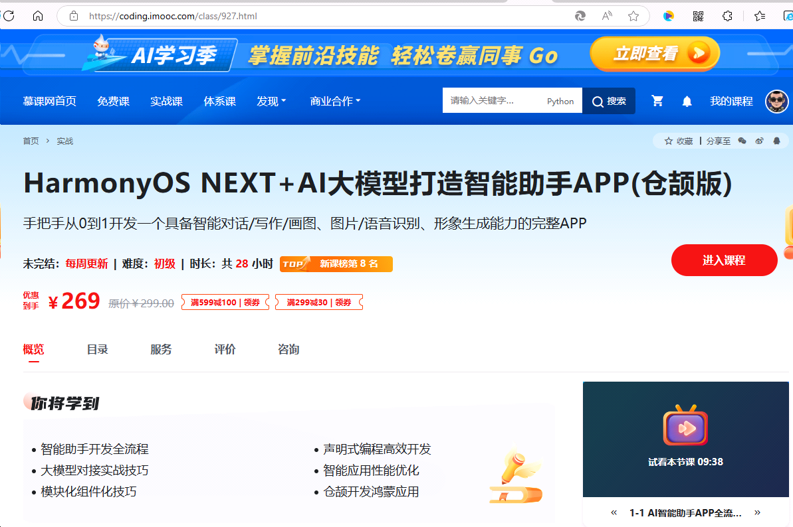

在科技飞速发展的当下，编程语言和操作系统的创新不断重塑着应用开发的格局。华为的仓颉编程语言自问世以来，便以其独特的优势和强大的功能，吸引了众多开发者的目光。而 HarmonyOS NEXT，作为华为全新一代操作系统，带来了更流畅、更智能、更安全的体验。当仓颉编程语言遇上 HarmonyOS NEXT，再结合当下热门的 AI 大模型，一场智能助手 APP 开发的盛宴就此开启，展现出令人惊叹的玩法。

<!-- more -->

## 仓颉编程语言：鸿蒙生态的璀璨明珠

仓颉编程语言专为 HarmonyOS 打造，是华为在编程语言领域的一次重大突破。它具有原生智能化的特性，通过内嵌 Agent DSL 的编程框架，巧妙地将自然语言与编程语言融合在一起。这意味着开发者在编写代码时，能够以更贴近人类自然语言表达的方式进行，极大地降低了编程门槛，提高了开发效率。例如，在描述一个简单的任务流程时，以往复杂的代码逻辑可能需要数行传统代码来实现，而在仓颉语言中，通过简洁明了的自然语言式表达就能轻松完成。

其多 Agent 协同机制，进一步简化了符号表达，不同的模式可以自由组合，为各类智能应用的开发提供了广阔的空间。无论是复杂的人工智能算法实现，还是高效的系统交互功能开发，仓颉都能应对自如。而且，它还拥有轻量化可缩放运行时，采用模块化分层设计，即使在内存有限的设备上也能稳定运行，同时借助元编程和 eDSL 技术，支持面向领域的声明式开发，让开发者能够更专注于业务逻辑本身，而非底层繁琐的技术细节。

在性能方面，仓颉表现卓越。它配备了终端场景首款全并发 GC，使得应用线程更加流畅，响应速度更快。轻量化线程设计，让并发性能得到显著提升的同时，降低了开销。在安全层面，安全 DNA 融入语言设计的每一个环节，开发者在编码过程中，无需花费过多精力在防御性编程上，便能有效避免常见的安全漏洞，真正做到编码即安全。

对于仓颉应用开发，请参阅《跟老卫学仓颉编程语言开发》。《跟老卫学仓颉编程语言开发》是笔者近些年打造，紧随趋势，不断更新。新人开源参考该开源书，进行学习。书中也提供demo示例，参见 <https://github.com/waylau/cangjie-programming-language-tutorial>

## HarmonyOS NEXT：智能时代的强大基石

HarmonyOS NEXT 作为华为新一代操作系统，摆脱了对安卓 AOSP 核心的依赖，拥有独立且强大的生态体系。它采用了全新的用户界面设计，重新设计的控制中心、直观的滑块以及大尺寸的开关，让用户操作更加便捷高效。在个性化方面，进一步优化了锁屏和主屏幕的设置，用户可以根据自己的喜好进行深度定制，打造独一无二的手机桌面。

安全性能是 HarmonyOS NEXT 的一大亮点。系统增强了应用安全检测，对于不符合安全要求的应用，坚决禁止安装，从源头上保障了用户的设备安全。同时，在文件加密方面也进行了升级，无论是用户个人文件存储，还是文件共享过程，都提供了更高等级的加密保护。此外，HarmonyOS NEXT 的 Ark 引擎在图形、媒体、内存管理、调度、存储等多个方面进行了全面升级，带来更低的功耗和更出色的网络浏览体验。与 HarmonyOS 4 相比，HarmonyOS NEXT 的内存运行效率提升了 1.5GB，系统流畅度提高了 30%，电池续航时间也增加了 55 分钟以上，为智能助手 APP 的稳定运行和高效服务提供了坚实的基础。

《跟老卫学HarmonyOS开发》是笔者五年时间打造，紧随趋势，不断更新，目前已经更新到HarmonyOS NEXT版本。新人开源参考该开源书，进行学习。书中也提供demo示例，参见 <https://github.com/waylau/harmonyos-tutorial>

## 融合 AI 大模型：智能助手的核心驱动力

当下，AI 大模型已成为智能应用的核心技术。通过将 AI 大模型融入基于仓颉编程语言和 HarmonyOS NEXT 开发的智能助手 APP 中，能够赋予其强大的智能交互和问题解决能力。AI 大模型可以对海量的文本数据进行深度学习，从而理解人类语言的复杂语义和语境。例如，当用户向智能助手提问时，AI 大模型能够快速准确地理解用户的意图，并从庞大的知识图谱中检索出相关信息，以最精准、最易懂的方式回答用户的问题。

在日常使用场景中，无论是查询天气、设置日程安排，还是获取专业的知识解答，智能助手都能凭借 AI 大模型的强大能力，提供高效、贴心的服务。而且，借助 AI 大模型的学习能力，智能助手能够不断自我优化和提升，根据用户的使用习惯和偏好，提供个性化的服务推荐。比如，当用户经常在特定时间段查询某类信息时，智能助手会主动在相应时间点推送相关内容，让用户体验到真正的智能化服务。

《跟老卫学AI大模型开发》是笔者近期打造，紧随趋势，不断更新。新人开源参考该开源书，进行学习。书中也提供demo示例，参见 <https://github.com/waylau/ai-large-model-tutorial/>

## 打造智能助手 APP：创新玩法与无限可能

利用仓颉编程语言在 HarmonyOS NEXT 系统上开发智能助手 APP，具有诸多创新玩法。首先，仓颉语言的原生智能化特性与 AI 大模型的结合，使得智能助手的交互更加自然流畅。开发者可以利用自然语言式的编程方式，轻松实现复杂的对话逻辑和交互功能。例如，通过简单的代码描述，就能让智能助手识别用户的语音指令，并以生动有趣的方式进行回应。

其次，HarmonyOS NEXT 强大的分布式能力，让智能助手能够跨越不同设备进行协同工作。无论是手机、平板、智能手表还是智能家居设备，智能助手都能无缝连接，为用户提供统一的智能服务。比如，用户在手机上设置了一个提醒事项，智能助手可以通过 HarmonyOS NEXT 的分布式技术，将提醒同步到用户的智能手表上，确保用户不会错过任何重要事件。

再者，借助仓颉语言丰富的三方库以及 HarmonyOS NEXT 开放的生态接口，开发者可以快速集成各种实用功能。例如，接入地图导航功能，让智能助手能够为用户提供精准的出行路线规划；整合智能家居控制功能，用户通过智能助手就能轻松控制家中的智能设备，实现更加便捷的智能生活体验。

在开发过程中，开发者还可以充分利用华为提供的开发工具和平台，如华为开发者联盟、仓颉社区等。这些平台不仅提供了丰富的文档资料、示例代码以及技术支持，还汇聚了众多开发者，大家可以在社区中交流经验、分享创意，共同推动智能助手 APP 的创新发展。

仓颉编程语言、HarmonyOS NEXT 与 AI 大模型的结合，为智能助手 APP 的开发带来了全新的玩法和无限的可能。这种创新的组合，不仅能够提升智能助手的性能和功能，还将为用户带来更加智能、便捷、个性化的服务体验。对于广大开发者而言，这无疑是一个充满机遇的时代，赶快加入到这场创新的浪潮中，用仓颉编程语言在 HarmonyOS NEXT 系统上打造出独具特色的智能助手 APP，开启智能应用开发的新篇章。

## 智能助手 APP 实战：从0开始构建智能助手

仓颉开发原生鸿蒙HarmonyOS智能AI助手实战课程“[HarmonyOS NEXT+AI大模型打造智能助手APP(仓颉版)](https://coding.imooc.com/class/927.html)”已经于近日上线，有致力于鸿蒙生态开发的同学们可以关注一下。

如果你想在大学竞赛，毕设，实习面试中脱颖而出，那学会开发一款高质量的AI智能应用APP是一个很不错的选择；如果你想从事AI智能应用开发，但缺乏对应的开发技能和完整流程指导，自己上手问题重重，无从下手？别担心，这门课程为你量身打造！本课程将从0到1带你开发一套AI智能助手APP，项目覆盖6大AI核心业务，包括：智能对话/写作/画图、图片/语音识别、形象生成能力等；项目采用模块化与通用组件化开发，能够让你快速掌握AI助手类应用开发全流程。同时，你还将学到如何使用仓颉语言开发原生鸿蒙应用的核心技能。总之，通过本课程的学习，你能够独立从想法到落地，全流程掌握移动端与AI融合技术的先进开发模式。助力你在大学竞赛，毕设，实习面试中先人一步取得优异成绩！

通过本课程，你将学到：

1. 智能助手开发全流程
2. 大模型对接实战技巧
3. 模块化组件化技巧 
4. 声明式编程高效开发 
5. 智能应用性能优化
6. 仓颉开发鸿蒙应用

课程效果如下：

视频演示<https://www.bilibili.com/video/BV15zXeYfEdY/> 

## 参考资料

更多示例源码、HarmonyOS学习资料可见

* 《跟老卫学AI大模型开发》开源免费教程， <https://github.com/waylau/ai-large-model-tutorial/>
* 《跟老卫学仓颉编程语言开发》开源免费教程， <https://github.com/waylau/cangjie-programming-language-tutorial>
* 《跟老卫学HarmonyOS开发》 开源免费教程，<https://github.com/waylau/harmonyos-tutorial>
* 《鸿蒙HarmonyOS手机应用开发实战》（清华大学出版社）
* 《鸿蒙HarmonyOS应用开发入门》（清华大学出版社）
* “鸿蒙零基础快速实战-仿抖音App开发（ArkTS版）”（<https://coding.imooc.com/class/843.html>）
* 《鸿蒙HarmonyOS应用开发从入门到精通（第2版）》（北京大学出版社)
* 《鸿蒙之光HarmonyOS NEXT原生应用开发入门》（清华大学出版社)
* “HarmonyOS NEXT+AI大模型打造智能助手APP(仓颉版)”（<https://coding.imooc.com/class/927.html>）
