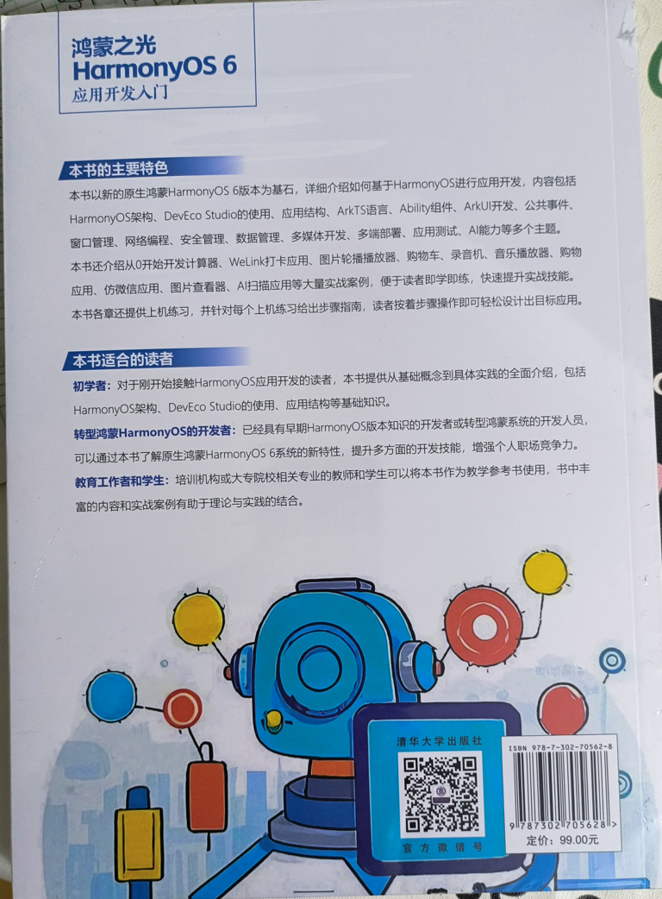

《鸿蒙之光HarmonyOS 6应用开发入门》已于近日上市，该书由清华大学出版社出版。该书以HarmonyOS 6版本为核心，从基础知识到实战案例，引领读者逐步探索“纯血鸿蒙”原生开发的奥秘。

本文希望与读者朋友们分享下这本书里面的大致内容。

<!-- more -->

## 封面部分

首先是介绍封面部分。

《鸿蒙之光HarmonyOS 6应用开发入门》封面左上角是本书的一些案例介绍，包括计算器、打卡应用、图片轮播播放器、购物车、录音机、音乐播放器、购物应用、仿微信应用、AI扫描应用、AI语音识别等原生应用。

封面中部也体现了本书的一些特色，比如本书附赠完整的上机练习、源代码和PPT课件，所有代码均经过严格测试验证，确保能够顺利运行并达到预期效果。这对于大中院校的师生来说非常友好，直接可以将这本书作为学习鸿蒙的上课教材。

封面底部是出版社“清华大学出版社”字样以及防伪标签。

## 封底部分

介绍封底部分。

封底部分主要分为以下几个部分。

### 1. 主要特色

本书以新的原生鸿蒙HarmonyOS 6版本为基石，详细介绍如何基于HarmonyOS进行应用开发，内容包括HarmonyOS架构、DevEco Studio的使用、应用结构、ArkTS语言、Ability组件、ArkUI开发、公共事件、窗口管理、网络编程、安全管理、数据管理、多媒体开发、多端部署、应用测试、AI能力等多个主题。
本书还介绍从0开始开发计算器、WeLink打卡应用、图片轮播播放器、购物车、录音机、音乐播放器、购物应用、仿微信应用、图片查看器、Al扫描应用等大量实战案例，便于读者即学即练，快速提升实战技能。
本书各章还提供上机练习，并针对每个上机练习给出步骤指南，读者按着步骤操作即可轻松设计出目标应用。

### 2. 适合的读者

* 初学者：对于刚开始接触HarmonyOS应用开发的读者，本书提供从基础概念到具体实践的全面介绍，包括HarmonyOS架构、DevEco Studio的使用、应用结构等基础知识。
* 转型鸿蒙HarmonyOS的开发者：已经具有早期HarmonyOS版本知识的开发者或转型鸿蒙系统的开发人员，可以通过本书了解原生鸿蒙HarmonyOS 6系统的新特性，提升多方面的开发技能，增强个人职场竞争力。
* 教育工作者和学生：培训机构或大专院校相关专业的教师和学生可以将本书作为教学参考书使用，书中丰富的内容和实战案例有助于理论与实践的结合。

### 3. 篇幅和定价

全书380页，较为丰富，定价为99元，也不算贵，非常极具有性价比。

## 内容简介

《鸿蒙之光HarmonyOS6应用开发入门》以HarmonyOS6版本为核心，从基础知识到实战案例，引领读者逐步探索“纯血鸿蒙”原生开发的奥秘。本书共分18章，内容涵盖HarmonyOS架构、DevEcoStudio使用、应用结构解析、ArkTS编程语言、Ability组件、ArkUI开发、公共事件处理、窗口管理、网络编程、安全管理、数据管理、多媒体开发、多端部署、应用测试及AI能力等关键主题。书中不仅详细阐述了相关理论知识，还结合了多个实战项目，如计算器开发、WeLink打卡系统、图片轮播播放器、购物车功能实现、录音机与音乐播放器创建、视频AI字幕与语音识别功能实现、购物应用设计与应用模拟、图片查看器构建、AI扫描应用开发等，旨在通过实际操作提升读者的动手能力和解决实际问题的能力。此外，《鸿蒙之光HarmonyOS 6应用开发入门》还附赠完整的源码和PPT课件，所有源码均经过严格测试验证，确保能够顺利运行并达到预期效果。《鸿蒙之光HarmonyOS 6应用开发入门》技术新颖，案例丰富，突出实战，特别适合作为HarmonyOS应用开发初学者、爱好者和进阶者的自学用书，也适合作为培训机构和大中专院校的教学用书。

## 写作背景

早在HarmonyOS 6正式发布之前，笔者便已密切关注其发展路线图，参加了多次华为组织的HarmonyOS 6开发者预览版Beta定向招募活动，开发了多款HarmonyOS 6应用。在各大论坛，笔者撰写了大量关于HarmonyOS 6新特性的文章，并进行技术布道，主讲了包括“鸿蒙HarmonyOS 6 AI应用开发”在内的多门视频课程。本书所选用的HarmonyOS 6版本是市面上首个正式版，具有重要的参考价值。

笔者此前已出版多本专著，如《鸿蒙HarmonyOS手机应用开发实战》《鸿蒙HarmonyOS应用开发从入门到精通》《鸿蒙HarmonyOS应用开发入门》和《鸿蒙之光HarmonyOS NEXT原生应用开发入门》，并长期维护开源书《跟老卫学HarmonyOS开发》。因此，撰写本书并未遇到太多困难。本书聚焦于HarmonyOS 6版本的常用核心功能，这些功能均经过笔者验证，确保可用性。其他非核心功能或存在bug的功能未收录本书，但会收入《跟老卫学HarmonyOS开发》并以开源方式不断演进。

## 内容介绍

本书以HarmonyOS 6版本为核心，通过循序渐进的方式，从基础理论到项目实战，引领读者深入探索“纯血鸿蒙”原生开发的精髓。全书内容从逻辑上分为三个主要部分：

入门（第1章）：介绍HarmonyOS 6的背景，并指导如何搭建开发环境，以及创建一个基础的HarmonyOS 6应用程序。

进阶（第2~14章）：深入讲解HarmonyOS 6的核心开发功能，包括ArkTS语言、Ability框架、ArkUI开发、公共事件处理、窗口管理、网络编程、安全管理、数据管理、多媒体开发、一次开发多端部署、应用测试及AI能力等多个方面。

实战（第15~18章）：通过综合案例，如“仿微信应用”“一多图片查看器”“购物应用”和“AI扫描应用”，展示HarmonyOS 6的实际应用开发。

本书不仅详细阐述了相关理论知识，还配合核心功能给出了诸多开发案例，如计算器开发、WeLink打卡、图片轮播播放器、购物车功能实现、录音机与音乐播放器创建、视频AI字幕与语音识别功能实现等，还在各章安排了上机练习题，旨在通过实际操作提升读者的动手能力和解决实际问题的能力。

## 技术版本

技术的版本非常重要，因为不同版本之间存在兼容性问题，且不同版本的软件功能各异。本书列出的技术版本相对较新，均经过笔者测试。建议读者将相关开发环境设置为与本书一致，或不低于本书所列配置，以避免版本兼容性问题。

本书所采用的技术与版本的详细配置如下：

* DevEco Studio 6.0.0 Release（6.0.0.858）
* HarmonyOS 6.0.0 Release SDK
* 操作系统：Windows 10 64位、Windows 11 64位
* 内存：16GB及以上
* 硬盘：100GB及以上
* 分辨率：1280*800像素及以上

## 源代码

本书提供的素材和源代码可从以下网址下载：
<https://github.com/waylau/harmonyos-tutorial>

## 勘误和交流

本书如有勘误，会在以下网址发布：
<https://github.com/waylau/harmonyos-tutorial/issues>

## 参考引用

* 原文同步至：<https://waylau.com/about-harmonyos-6-tutorial-book/>
* 视频介绍可见B站：<https://www.bilibili.com/video/BV1b1rwBREbk/>
* [京东](https://item.jd.com/10208282739020.html)
* [当当](https://search.dangdang.com/?key=%BA%E8%C3%C9%D6%AE%B9%E2HarmonyOS%206%D3%A6%D3%C3%BF%AA%B7%A2%C8%EB%C3%C5&act=input)