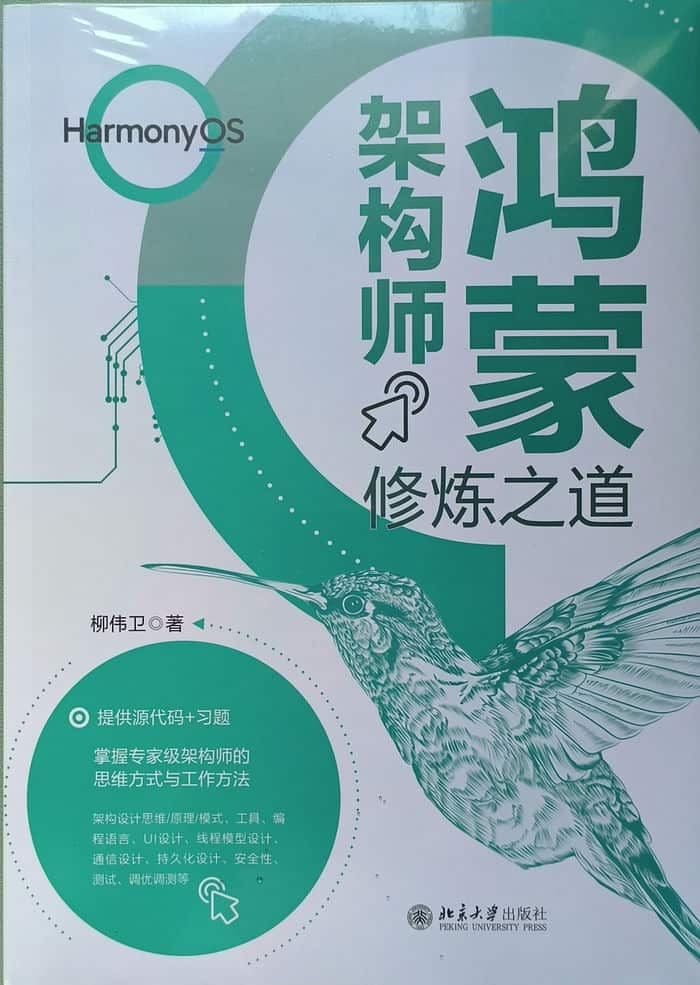

《鸿蒙架构师修炼之道》已于近日上市，该书由北京大学出版社出版。该书主要介绍如何培养鸿蒙架构师，内容涉及HarmonyOS架构设计思维/原理/模式、工具、编程语言、UI设计、线程模型设计、通信设计、持久化设计、安全性、测试、调优调测等多方面。

本文希望与读者朋友们分享下这本书里面的大致内容。

<!-- more -->

## 封面部分

首先是介绍封面部分。

《鸿蒙架构师修炼之道》封面右上角是本书的书名，清晰凸显出“鸿蒙”及“HarmonyOS”字眼。

封面整体色调是青色，小清新、富有活力。

右下角貌似是一只蜂鸟。蜂鸟寓意着坚韧与勇气‌：蜂鸟体型虽小，却拥有惊人的飞行能力，能悬停、倒飞，象征着以微小之躯挑战巨大困难的精神。本书封面配以蜂鸟，体现了在鸿蒙架构师修炼道路上，需要极大的勇气与自我价值的肯定。‌ 

封面左下角体现了本书的一些特色，比如：

* 本书附赠完整的源代码和习题，所有代码均经过严格测试验证，确保能够顺利运行并达到预期效果。这对于大中院校的师生来说非常友好，直接可以将这本书作为学习鸿蒙的上课教材。
* 本书介绍专家级架构师的思维方式与工作方法。
* 本书介绍HarmonyOS架构设计思维/原理/模式、工具、编程语言、UI设计、线程模型设计、通信设计、持久化设计、安全性、测试、调优调测等多方面。

封面底部是出版社“北京大学出版社”字样。

## 封底部分

介绍封底部分。

封底部分较为简介，跟封面内容相似。

全书400页，较为丰富，定价为119元，也不算贵，非常极具有性价比。

## 内容简介

所有程序员都有成为架构师的潜力，只要掌握了架构师的思维方式和工作方法，你也能成长为架构师。 鸿蒙操作系统是华为自研的、面向万物互联的全场景分布式操作系统，支持手机、平板、PC、智能穿戴、智慧屏等多种终端设备运行，是提供应用开发、设备开发的一站式服务的平台。随着 HarmonyOS NEXT 正式 发布，市面上对于鸿蒙架构设计方面的需求呈井喷之势。 本书以最新的 HarmonyOS 版本为基石，详细介绍成为鸿蒙架构师应具备和掌握的核心能力和工 作方法，包括架构设计思维、架构设计原理、架构设计模式、工具、编程语言、UI 设计、线程模型设计、通信设计、持久化设计、安全性、测试、调优调测等多个主题。 本书不但通过真实案例讲解架构设计流程和经验，还总结了丰富的鸿蒙架构师工作原则和技巧，尤其适合广大鸿蒙程序员进阶学习。同时，学习本书也有助于产品经理、测试人员、运维人员和其他行业从业者理解鸿蒙软件架构设计工作。

全书总共包含13章，包括：

* 第1章 成为鸿蒙架构师
* 第2章 架构设计思维
* 第3章 架构设计原理
8 第4章 架构设计模式
* 第5章 工具
* 第6章 编程语言
* 第7章 UI设计
* 第8章 线程模型设计
* 第9章 通信设计
* 第10章 持久化设计
* 第11章 安全性
* 第12章 测试
* 第13章 调优调测

更多介绍，详见“参考引用”。

## 写作背景

自HarmonyOS面世之时，笔者便已经开始关注HarmonyOS的发展。笔者在各大论坛也对HarmonyOS进行过非常多的文章介绍以及技术布道。本书所选用HarmonyOS版本的也是市面上能看到的最新正式版本。

由于笔者长期混迹于鸿蒙开发与推广，出版过多本关于鸿蒙的专著，包括《鸿蒙HarmonyOS手机应用开发实战》《鸿蒙HarmonyOS应用开发从入门到精通》《鸿蒙之光HarmonyOS NEXT原生应用开发入门》《鸿蒙之光HarmonyOS 6应用开发入门》等等，并在长期维护一本开源书《[跟老卫学HarmonyOS开发](https://github.com/waylau/harmonyos-tutorial)》，但这些书籍都是介绍如何入门鸿蒙生态，如何进行HarmonyOS应用开发。《鸿蒙架构师修炼之道》不同点在于，这是一本专注于培养鸿蒙架构师的教程，是一名鸿蒙开发老兵的经验升华，在业界尚属首例。

本书的内容聚焦于告诉读者鸿蒙架构师是如何修炼的，成为鸿蒙架构师应具备怎么样的核心能力和工作方法，包括架构设计思维、架构设计原理、架构设计模式、工具、编程语言、UI设计、线程模型设计、通信设计、持久化设计、安全性、测试、调优调测等。本书不但通过真实案例讲解架构设计流程和经验，还总结了丰富的鸿蒙架构师工作原则和技巧，尤其适合广大鸿蒙开发人员进阶学习。

## 源代码

本书提供的素材和源代码可从以下网址下载：
<https://github.com/waylau/harmonyos-tutorial>

## 勘误和交流

本书如有勘误，会在以下网址发布：
<https://github.com/waylau/harmonyos-tutorial/issues>

## 参考引用

* 原文同步至：<https://waylau.com/about-the-cultivation-of-harmonyos-architect-book/>
* 视频介绍可见B站：<https://www.bilibili.com/video/BV1hw6TBiEgQ/>
* [京东](https://search.jd.com/Search?keyword=%E9%B8%BF%E8%92%99%E6%9E%B6%E6%9E%84%E5%B8%88%E4%BF%AE%E7%82%BC%E4%B9%8B%E9%81%93&enc=utf-8&wq=%E9%B8%BF%E8%92%99%E6%9E%B6%E6%9E%84%E5%B8%88%E4%BF%AE%E7%82%BC%E4%B9%8B%E9%81%93)
* [当当](https://product.dangdang.com/30005979.html)

