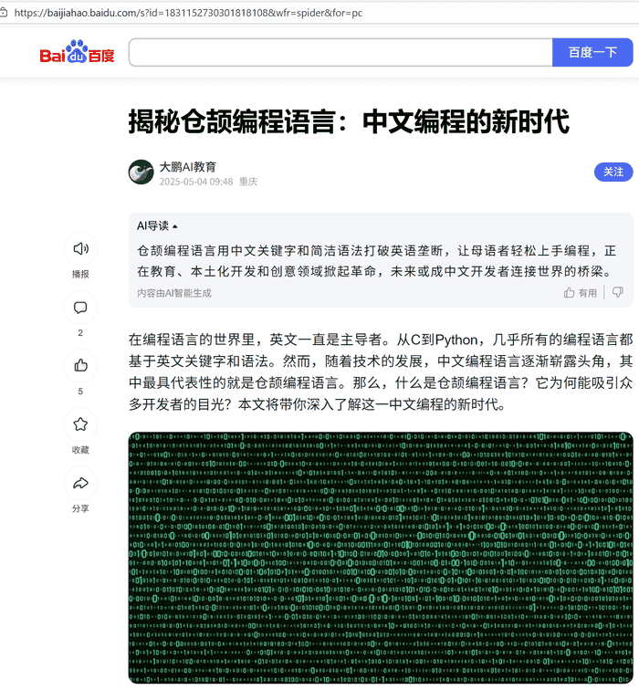
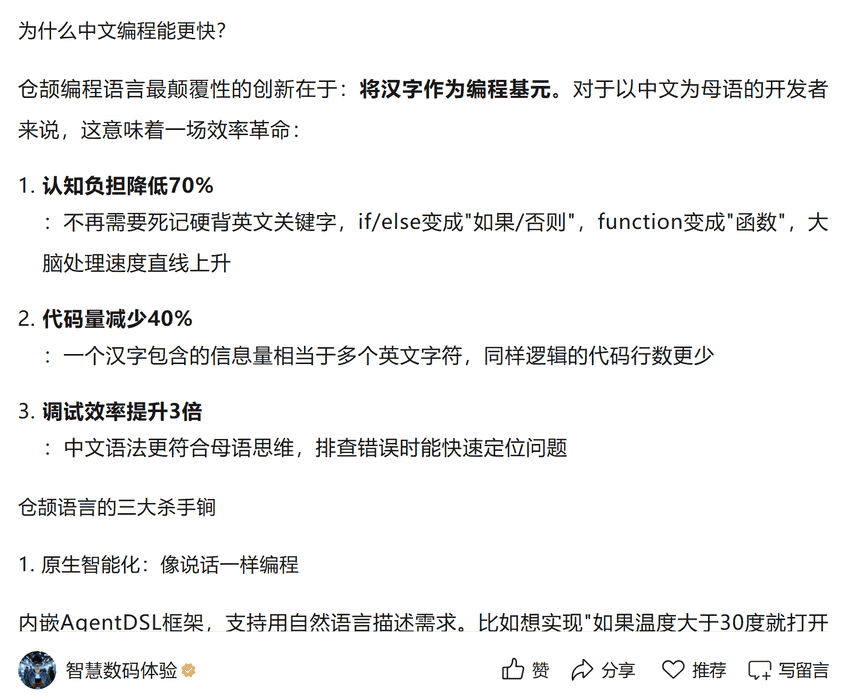

在“[HarmonyOS NEXT+AI大模型打造智能助手APP(仓颉版)](https://coding.imooc.com/class/927.html)”课程里面以及在一些自媒体平台，有网友提到了这样一个问题：
仓颉编程语言不是中文编程语言吗？怎么语法还是英文？

<!-- more -->

说实话，看到这种问题，笔者还是比较震惊的，毕竟，仓颉编程语言面市差不多有2年了吧。2024年6月21日下午，华为开发者大会主题演讲《鸿蒙原生应用，全新出发！》中向全球开发者介绍了华为自研编程语言“仓颉”，并发布了HarmonyOS NEXT仓颉编程语言开发者预览版。这是华为首次公开发布仓颉编程语言。

这里就这位网友的问题，统一做下回复，以方便其他同学参考。往期问答，可以在我主页查到。

## 谣言从何而起

谣言从何而起呢？时至今日，在网上很多自媒体还在传播仓颉是中文编程语言的谣言。比如以下:

那么，为什么很多人都确信仓颉是中文编程语言的谣言呢？网上流传仓颉是中文编程语言的谣言，根源在于名称联想、信息差、传播机制与认知偏差叠加，再加上官方早期信息不透明，最终形成并扩散。具体原因如下：

### 1、名称与文化符号的误导
“仓颉”源自中文造字神话，天然关联“中文/汉字”意象，易让公众将“语言命名”与“语法本质”混淆。早期讨论中，部分自媒体为吸引眼球，刻意强化“国产自研=中文语法”的错误绑定，放大认知偏差。

### 2、官方早期信息不透明与碎片化解读
仓颉在2022年曝光至2023年逐步公开期间，官方仅强调“鸿蒙生态语言”，未及时明确否认中文语法，给谣言留下传播空间。少量内测截图被断章取义，如中文注释、中文标识符示例被误传为“中文关键字”，进一步加剧误解。

### 3、传播机制与流量驱动
- **自媒体与社交平台**：为博流量，部分账号发布“仓颉=中文编程”的标题党内容，利用“国产替代”情绪制造话题，导致错误信息病毒式传播。
- **信息茧房效应**：中文社区对“本土语言降低入门门槛”的期待，使谣言在同类群体中反复强化，形成“三人成虎”的传播闭环。

### 4、概念混淆与认知偏差
1. **中文命名≠中文语法**：公众易将编程语言的“命名”与“关键字/语法体系”等同，忽视关键字仅为助记符，与底层编译逻辑无关。
2. **中文编程的刻板印象**：部分人认为“国产语言必须用中文”，忽略全球编程生态以英文为通用规范的现实，将“中文友好”误读为“中文语法”。
3. **技术细节认知不足**：多数非开发者不了解编译器、工具链基于英文优化，中文语法需重构工具链的技术成本，从而轻信“仓颉用中文语法”的传言。

### 5、中文编程的市场期待与情绪放大
国内长期存在“中文编程降低入门门槛”的呼声，易语言等案例强化了“中文编程可行”的认知，公众将对“本土语言”的期待投射到仓颉上，进一步推动谣言传播。

## 仓颉编程语言是英文编程语言

仓颉编程语言并非中文编程语言，其关键字、语法体系均采用国际通用的英文范式，仅名称源自中文造字神话，官方也明确否认其为中文编程。核心原因可归纳为以下几点：

### 1、设计定位与生态兼容
仓颉的核心目标是打造鸿蒙生态的全场景现代编程语言，追求高性能、强安全与跨平台能力，需兼容全球开发者社区与主流技术栈。若采用中文关键字，会与C/C++、Java、TypeScript等主流语言的语法习惯割裂，大幅增加开发者迁移成本，阻碍生态扩张。

### 2、技术与工程效率考量
1. **输入与编码效率**：英文关键字（如if、for、class）字符少、输入快，适配ASCII/Unicode的底层编码体系；中文关键字易出现编码不一致、大小写/全半角混淆等问题，增加协作与调试难度。
2. **编译与工具链适配**：现有编译器、IDE、静态检查工具均基于英文关键字优化，中文语法需重构整套工具链，研发成本高且兼容性风险大。
3. **性能无增益**：关键字仅为助记符，最终都会编译为二进制指令，中文与否不影响运行性能。

### 3、社区协作与知识共享
全球编程生态以英文为通用语言，技术文档、开源项目、社区讨论均依赖英文体系。仓颉采用英文语法，可降低跨国协作门槛，快速融入全球开源社区，吸引更多开发者参与共建。

### 4、中文编程的局限性
中文编程语言（如易语言）虽降低入门门槛，但存在语法冗余、工具链不完善、跨平台适配差等问题，难以满足系统级开发与大规模团队协作需求。仓颉优先保障语言的专业性与通用性，中文仅作为辅助文档语言，而非核心语法元素。

## 谣言止于智者

仓颉编程语言虽然不是中文编程语言，但它是中国的编程语言，由华为公司自研，是国产自研的代表作！

要终止谣言，最好的方式就是去接触它，了解它。

更多仓颉学习资料，详见：

* 原文同步至：<https://waylau.com/cangjie-programming-language-is-not-a-chinese-programming-language/>
* 《跟老卫学HarmonyOS开发》：<https://github.com/waylau/harmonyos-tutorial>
* 《跟老卫学仓颉编程语言开发》：<https://github.com/waylau/cangjie-programming-language-tutorial>
* “HarmonyOS NEXT+AI大模型打造智能助手APP(仓颉版)”：<https://coding.imooc.com/class/927.html>
* 《仓颉编程从入门到实践》（北京大学出版社）：<https://coding.imooc.com/class/927.html>