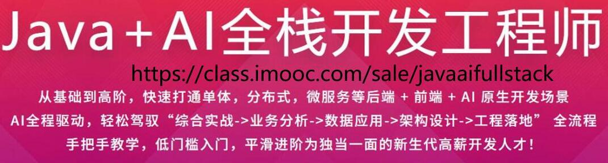
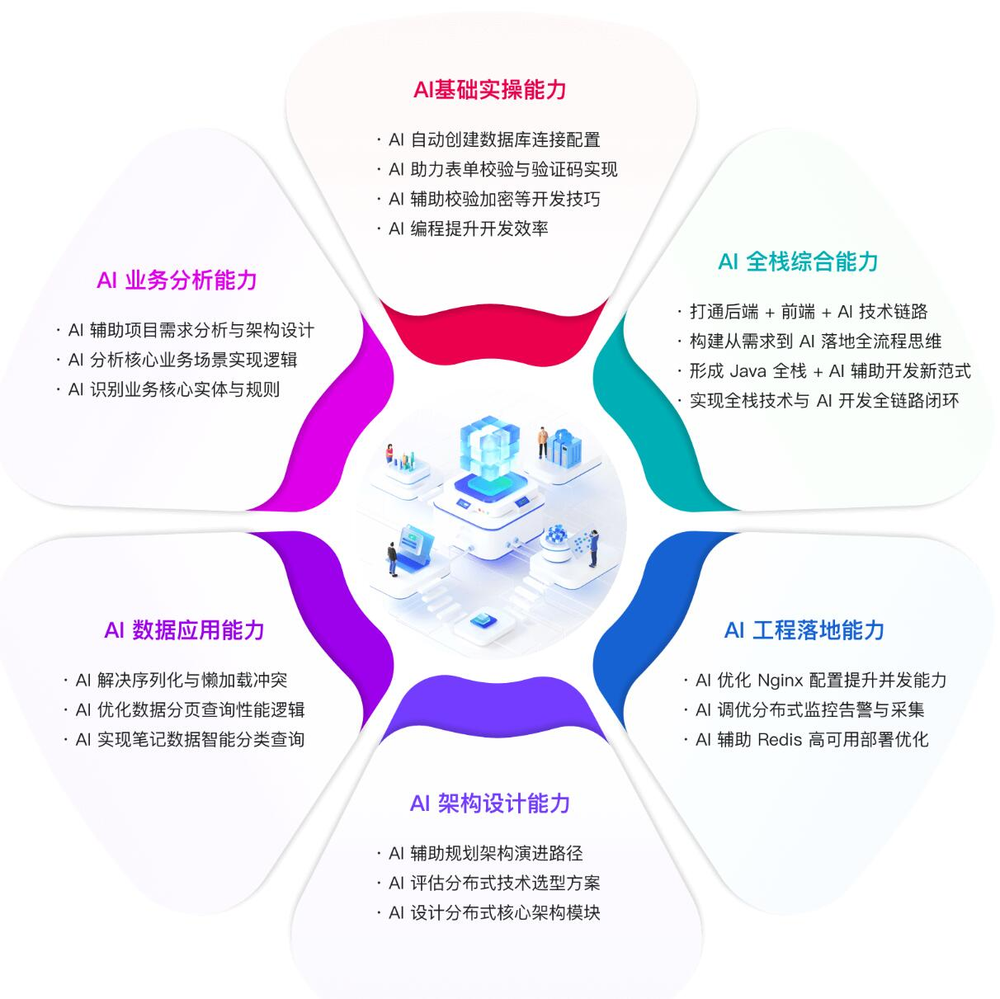
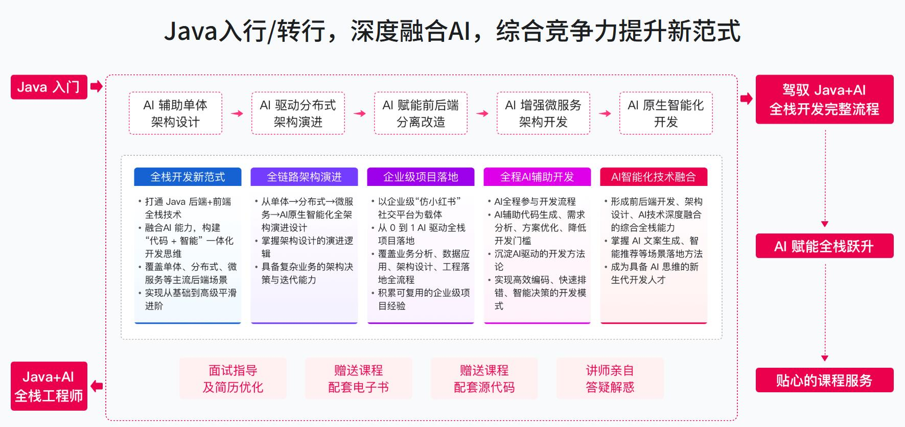
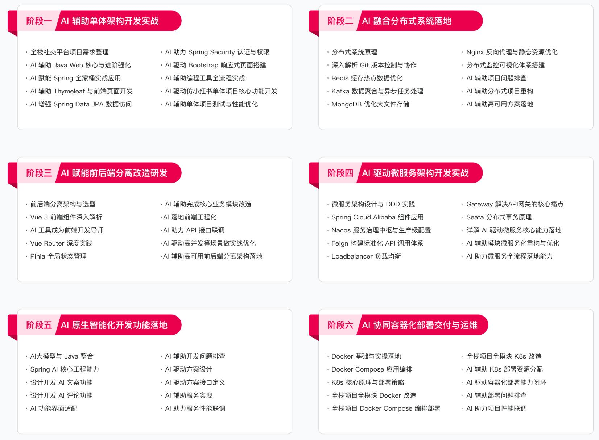
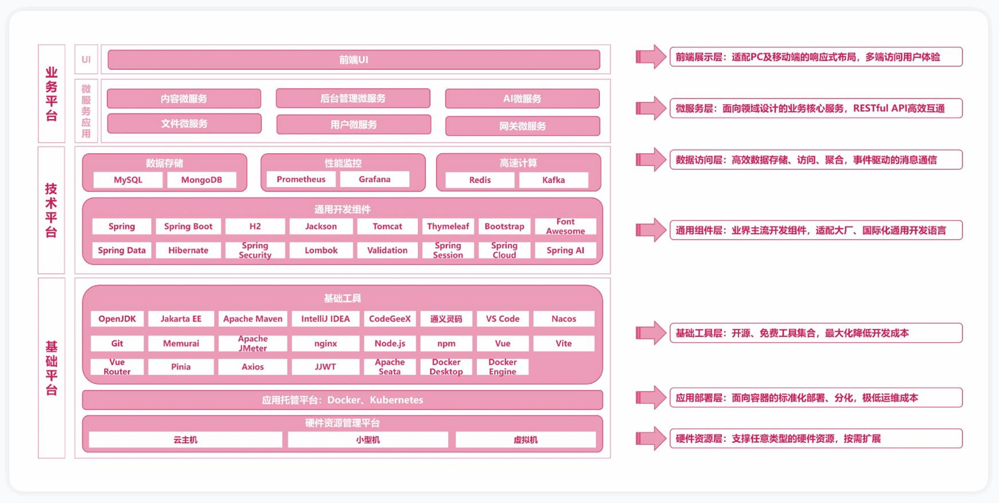

AI浪潮席卷开发领域，纯CRUD岗位需求暴跌22%，而**AI+Java全栈复合型人才**岗位需求暴涨210%，年薪中位数直冲45-70万！你还在做被AI替代的基础开发？不如抢占风口，从Java开发升级为**AI Native全栈工程师**，一手抓Java全栈硬实力，一手握AI原生开发核心能力，成为企业疯抢的技术稀缺人才！

<!-- more -->

慕课网“[Java+AI全栈工程师](https://class.imooc.com/sale/javaaifullstack)”课程重磅上线，**24周系统化教学+12个月全程伴学**，从零基础入门到高阶实战，手把手带你打通**后端+前端+AI原生开发**全场景，以企业级「仿某书」项目贯穿全程，完成从单体架构到分布式、前后端分离、微服务、AI融合、容器化部署的全链路实战，手敲代码锤炼真功夫，让你毕业即能独当一面，轻松拿下高薪offer！

## 六大阶段进阶，从入门到全栈高手，全程AI驱动

拒绝零散知识点，采用**演进式教学体系**，从基础到高阶层层递进，AI全程融入开发全流程，让你不仅会用AI工具，更能设计AI友好的系统架构，真正实现“AI赋能开发，开发落地AI”：
✅**AI辅助单体架构**：吃透Spring全家桶、权限安全、前端基础，完成仿某书单体项目全功能开发，AI助力代码校验、加密与性能优化
✅**AI融合分布式系统**：掌握Redis、Kafka、MongoDB核心中间件，实现项目分布式重构，打造高可用、高并发分布式架构
✅**AI赋能前后端分离**：精通Vue3前端开发，完成项目前后端分离改造，AI辅助前端组件开发与交互优化
✅**AI驱动微服务架构**：吃透Spring Cloud Alibaba生态，基于DDD完成微服务拆分，落地分布式事务与服务治理
✅**AI原生智能化落地**：掌握Spring AI生态、提示词工程，实现AI文案生成、评论助手等实战功能，让项目具备真正的AI能力
✅**AI协同容器化部署**：精通Docker+K8s容器化技术，完成项目一键编排与部署，掌握AI全栈工程师必备运维能力

## 企业级实战贯穿，学完即拥有可写进简历的核心项目
课程以**企业级社交平台「仿某书」**为核心实战项目，覆盖笔记发布、内容推荐、互动评论、后台管理等全核心业务场景，架构从**单体→前后端分离→分布式→微服务→AI原生开发→容器化部署**逐步演进，深度融合AI技术，落地AI辅助开发、智能文案生成等实用功能。
全程都有实操案例、企业级项目实战，从需求分析、架构设计到工程落地、部署运维，还原真实企业开发流程，让你掌握“业务分析→数据应用→架构设计→工程落地”全流程能力，学完即可将高含金量项目写入简历，面试时更有底气！

## 低门槛入门，高含金量输出，专为应届生/初级工程师/转行人士定制
✅**零基础友好**：技术大咖亲授，从Java基础到AI开发，层层拆解难点，手把手教学，即使是编程小白也能轻松入门
✅**全程伴学保障**：120小时高清视频+12个月教学服务，学习过程全程答疑，解决你的后顾之忧
✅**实战能力至上**：拒绝纸上谈兵，手敲代码，每一个知识点都搭配实战案例，学完即能用，真正做到“学以致用”
✅**高薪赛道适配**：精准对接面向未来的企业核心需求，掌握AI+Java全栈核心技能，适配AI应用开发、微服务架构师、云原生开发等高薪岗位，毕业即具备职场竞争力

## 现在报名，抢占AI时代高薪先机

零风险试学，12个月全程教学服务，让你学透、学懂、学出成果！
告别被AI替代的焦虑，抓住AI时代的技术红利，从Java开发升级为**AI+全栈双料人才**，从此告别低薪内卷，成为企业争抢的高薪开发工程师！

👉**[立即报名](https://class.imooc.com/sale/javaaifullstack)**，在享受上新特惠价基础上，还能再额外领取优惠券！ 

AI时代，技术不升级，就会被淘汰！现在入局，未来可期，你的高薪全栈开发之路，从这里开始！

视频演示<https://www.bilibili.com/video/BV1xrAnzdEwr/>
