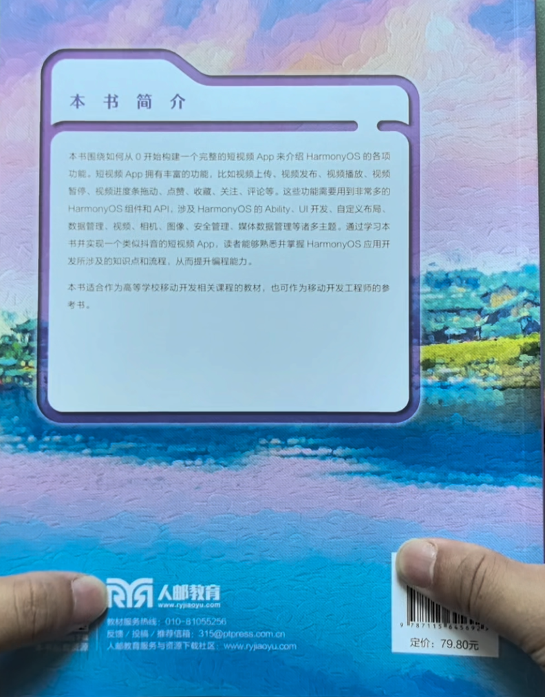
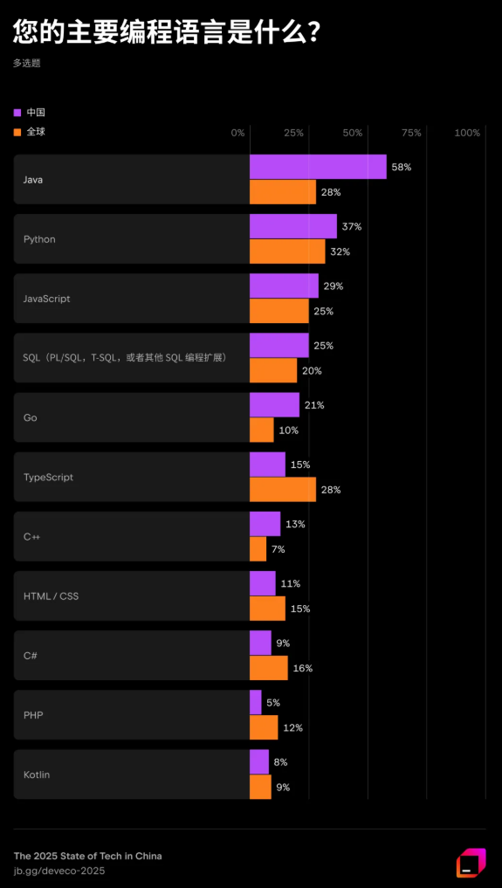

近期拿到《鸿蒙系统（HarmonyOS）移动开发实战》样书，该书由人民邮电出版社出版。围绕如何从0开始构建一个完整的类似于“抖音”的短视频App来展开。

本文希望与读者朋友们分享下这本书里面的大致内容。

<!-- more -->

## 写作背景

2023年，笔者应慕课网邀请录制了“鸿蒙系统实战短视频App 从0到1掌握HarmonyOS”视频课程。该课程系统学习HarmonyOS组件和API，实战HarmonyOS 9大主题核心技术，具备0到1独立实现完整HarmonyOS短视频App实战能力，助力移动端开发者拓展职业新边界。本书可谓是该视频课程的姊妹篇，将视频课程中的知识点做了归纳整理，并且补充了视频中无法深入讲解的技术细节。
 
鸿蒙教材初稿完成时间是2023年6月，期间出版社校稿、改稿等原因，一直到2025年12月才得以出版，最近才拿到样书。
从完成初稿到正式出版历时近三年，这三年间鸿蒙已经发生了巨大变化，版本也已经升级到了 HarmonyOS 6，主力开发语言改为了ArkTS、仓颉。
这意味着本书的内容在涉及API上可能存在过时的问题。当时书中所用的版本是HarmonyOS 3，开发语言是Java。

不过即便如此，本书亦有可取之处。

## 封面部分

首先是介绍封面部分。

《鸿蒙系统（HarmonyOS）移动开发实战》封面右上角是本书的一些特色介绍，包括全面呈现HarmonyOS开发要点、帮助读者掌握开发、配套立体化教学资源、全方位服务教师教学。左上角可以看出，本书是纳入了“人才培养系列丛书”。

封面底图看着是一幅油画，似晚霞又像是照样初升，极具梦幻色彩。

封面底部是出版社“人民邮电出版社”字样。

## 封底部分

介绍封底部分。

封底部分主要内容简介。

本书的主线都是围绕如何从0开始构建一个完整的短视频App来介绍HarmonyOS的各项功能。短视频App拥有非常丰富的功能，比如视频的上传、视频的发布、视频的播放、视频的暂停、视频进度条拖动、点赞、收藏、关注、评论等众多功能。针对这些功能，需要用到非常多的HarmonyOS里面的组件和API，包括HarmonyOS的Ability、UI开发、自定义布局、数据管理、视频、相机、图像、安全管理、媒体数据管理等诸多主题。通过学习并实现一个类似抖音的短视频App，使读者能够熟悉并掌握HarmonyOS应用开发的所涉及的知识点和流程，从而提升编程能力。

本书适合作为高等学习移动开发相关课程的教材，也可以作为移动开发工程师的参考书。

全书共计347页，可能是面向教育领域的原因，定价79.8元，极具性价比。

## 源代码

本书提供的素材和源代码可从以下网址下载：
<https://github.com/waylau/harmonyos-tutorial>

## 勘误和交流

本书如有勘误，会在以下网址发布：
<https://github.com/waylau/harmonyos-tutorial/issues>

## 参考引用

* 原文同步至：<https://waylau.com/about-harmonyos-short-video-book/>
* 视频介绍可见B站：<https://www.bilibili.com/video/BV1pQRNBsEMP/>
* [京东](https://item.jd.com/15314406.html)
* [当当](https://product.dangdang.com/30013844.html)

## 本书优势

## 对Java开发者友好

书中所用的版本是HarmonyOS 3，开发语言是Java。如果你熟悉Java，或者是Android阵营转过来的，那么本书非常适合你。

众所周知，HarmonyOS 3的API在设计上是参考了Android的API，很多概念都是类似的，如果你具备使用Java开发Android应用的经验，那么从Android应用开发迁移到HarmonyOS应用开发门槛也是非常低的。

## 兼顾Android/鸿蒙生态

HarmonyOS 3的一个特点是其操作系统是内嵌了AOSP代码，可以兼容安卓开源应用。这意味着用该版本开发的应用可以有更广的适配性，同时兼容Android/鸿蒙生态。

## 商业化项目实现

本书的主线都是围绕如何从0开始构建一个完整的类似于“抖音”的短视频App来展开。短视频App拥有非常丰富的功能，比如视频的上传、视频的发布、视频的播放、视频的暂停、视频进度条拖动、点赞、收藏、关注、评论等众多功能。针对这些功能，需要用到非常多的HarmonyOS里面的组件和API，包括HarmonyOS的Ability、UI开发、自定义布局、数据管理、视频、相机、图像、安全管理、媒体数据管理等诸多主题。通过学习并实现一个类似抖音的短视频App，使读者能够熟悉并掌握HarmonyOS应用开发的所涉及的知识点和开发流程，产生浓厚的学习热情，提升读者能力水平。完整实现案例讲解，理论贴近实战，利于读者掌握。读者学习完成之后，能够独立承担HarmonyOS App的设计与实现，拓宽就业机会，挑战更高薪资！

因此，即便不考虑具体的代码实现，但从APP的设计、规划而言，本书也是有非常大的商业价值。如果你正好从事短视频类的鸿蒙应用开发，那么本书可助你一臂之力。

## 应用开发的两种技术栈

HarmonyOS提供了支持多种开发语言的API，供开发者进行应用开发。支持的开发语言包括ArkTS、JS（JavaScript）、C/C++ 、Java等等。

从主流的发展而言，HarmonyOS应用开发的主要分为两种技术栈，即以ArkTS为核心的技术栈及以Java为核心的技术栈。

#### 1. Java为核心的技术栈

Java是自HarmonyOS诞生以来主力应用开发语言，也是目前能够实现HarmonyOS所有特性功能的最为重要的语言。

Java是世界上最为流行的开发语言之一，同时也是Android应用开发的核心语言。下图是来自 JetBrains 调查数据显示 Java在中国“断层式领先”
。

尽管 Java 在全球范围内是主流开发语言，但还有其他语言与之齐头并进，甚至超越。但在中国，它的普及程度远超其他地区。从全球平均水平来看，约有27.76%的专业开发者将 Java 作为主要开发语言，与 JavaScript 和 Python 形成了相对平衡的“三足鼎立”之势。然而在中国，Java 的优势呈现”断层式领先“：有58.17%以上中国开发者将其作为首选语言。

本书主要是介绍以Java作为核心技术栈的HarmonyOS应用开发，相关示例也是采用Java编写。因此，只要是具备Java开发的基本知识，就可以轻松入门HarmonyOS应用开发了。当然，如果你具备使用Java开发Android应用的经验，那么从Android应用开发迁移到HarmonyOS应用开发门槛也是非常低的。

#### 2. ArkTS为核心的技术栈

ArkTS是自HarmonyOS 3版本引入的，是新版HarmonyOS优选的主力应用开发语言。ArkTS基于TypeScript（简称TS）语言扩展而来，是TS的超集。

* ArkTS继承了TS的所有特性。
* 当前，ArkTS在TS基础上主要扩展了声明式UI能力（即ArkUI），让开发者以更简洁、更自然的方式开发高性能应用。
* 未来，ArkTS会结合应用开发/运行的需求持续演进，逐步提供并行和并发能力增强、类型系统增强、分布式开发范式等更多特性。

当前扩展的声明式UI（即ArkUI）包括如下特性。

* 基本UI描述：ArkTS定义了各种装饰器、自定义组件、UI描述机制，再配合UI开发框架中的UI内置组件、事件方法、属性方法等共同构成了UI开发的主体。
* 状态管理：ArkTS提供了多维度的状态管理机制，在UI开发框架中，和UI相关联的数据，不仅可以在组件内使用，还可以在不同组件层级间传递，比如父子组件之间、爷孙组件之间，也可以是全局范围内的传递，还可以是跨设备传递。另外，从数据的传递形式来看，可分为只读的单向传递和可变更的双向传递。开发者可以灵活的利用这些能力来实现数据和 UI 的联动。
* 动态构建UI元素：ArkTS提供了动态构建UI元素的能力，不仅可自定义组件内部的UI结构，还可复用组件样式，扩展原生组件。
* 渲染控制：ArkTS提供了渲染控制的能力。条件渲染可根据应用的不同状态，渲染对应状态下的部分内容。循环渲染可从数据源中迭代获取数据，并在每次迭代过程中创建相应的组件。
使用限制与扩展：ArkTS在使用过程中存在限制与约束，同时也扩展了双向绑定等能力。

所以，如果你熟悉JS或者TS，那么选择以ArkTS为核心的技术栈来开发HarmonyOS应用是非常合适的。

## 更多鸿蒙资料选择

除了本书，也有其他优秀参考资料可供选择。以下是鸿蒙应用开发常用教程。

* 《跟老卫学HarmonyOS开发》开源免费教程， <https://github.com/waylau/harmonyos-tutorial>
* 《跟老卫学AI大模型开发》开源免费教程， https://github.com/waylau/ai-large-model-tutorial/
* 《跟老卫学仓颉编程语言开发》开源免费教程， https://github.com/waylau/cangjie-programming-language-tutorial
* 《鸿蒙HarmonyOS手机应用开发实战》（清华大学出版社）
* 《鸿蒙HarmonyOS应用开发入门》（清华大学出版社）
* “鸿蒙零基础快速实战-仿抖音App开发（ArkTS版）”（https://coding.imooc.com/class/843.html）
* [《鸿蒙HarmonyOS应用开发从入门到精通（第2版）》](https://waylau.com/about-harmonyos-application-development-from-zero-to-hero-2nd-edition-book/)（北京大学出版社)
* [《鸿蒙之光HarmonyOS NEXT原生应用开发入门》](https://waylau.com/about-harmonyos-next-tutorial-book/)（清华大学出版社)
* “HarmonyOS NEXT+AI大模型打造智能助手APP(仓颉版)”（https://coding.imooc.com/class/927.html）
* “HarmonyOS 6 AI应用开发”(https://edu.51cto.com/course/39601.html)
* [《仓颉编程从入门到实践》](https://waylau.com/about-cangjie-programming-language-tutorial-book/)（北京大学出版社）
* [《鸿蒙之光HarmonyOS 6应用开发入门》](https://waylau.com/about-harmonyos-6-tutorial-book/)（清华大学出版社）
* [《鸿蒙架构师修炼之道》](https://waylau.com/about-the-cultivation-of-harmonyos-architect-book/)（北京大学出版社）

