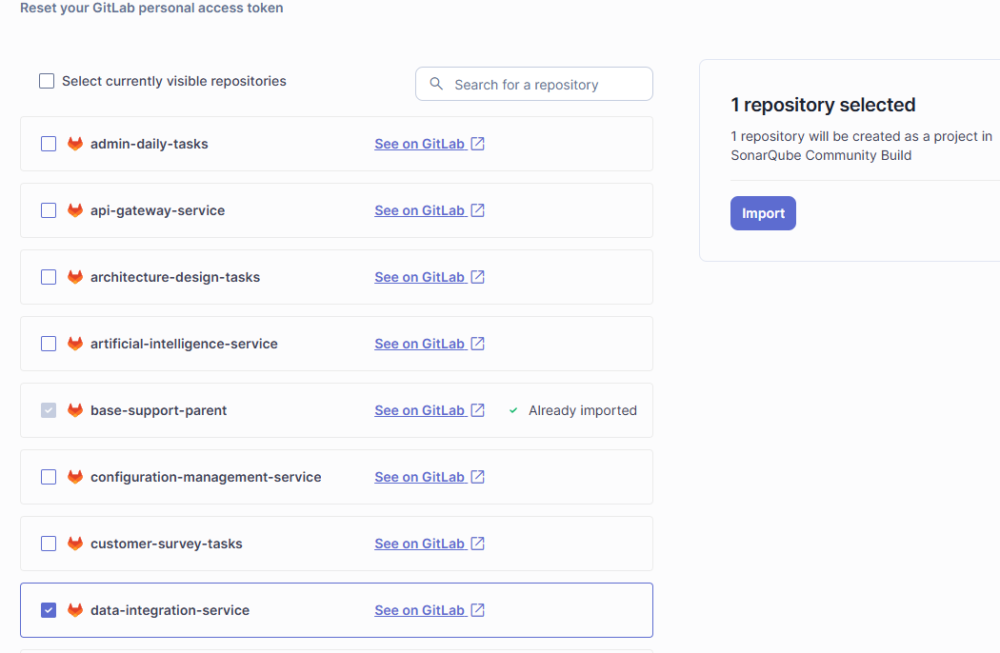
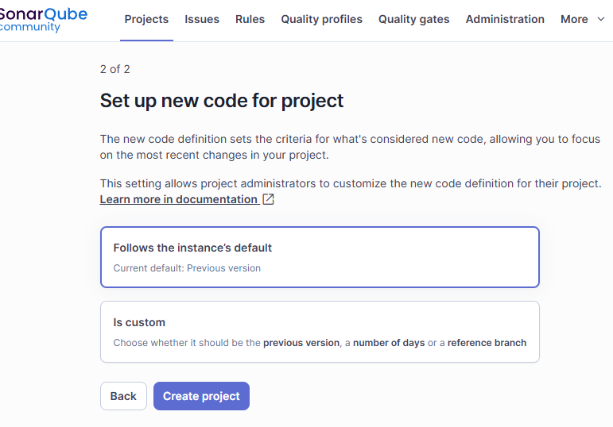
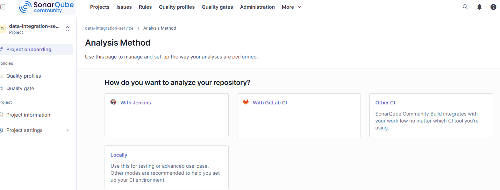
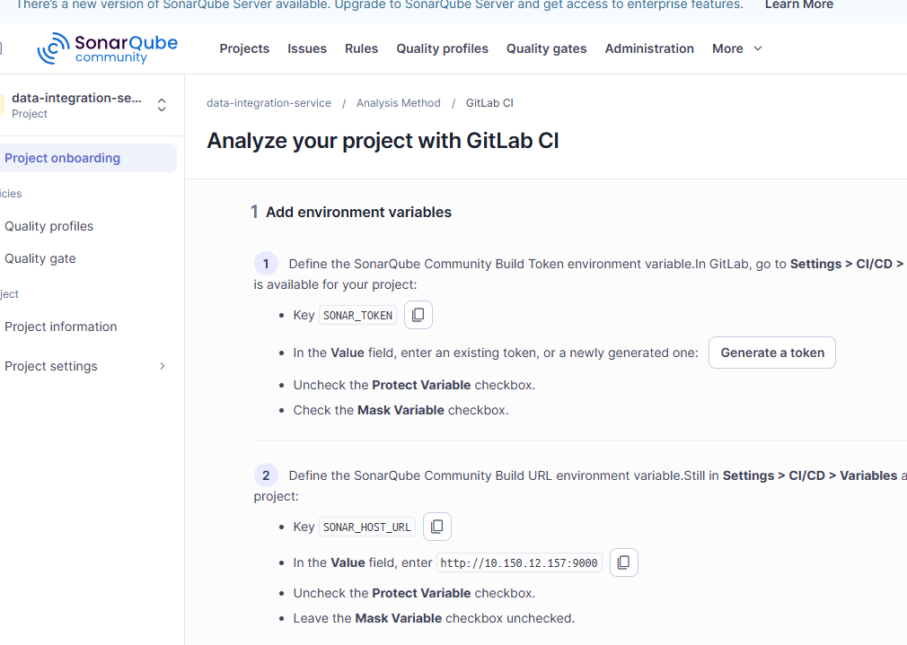
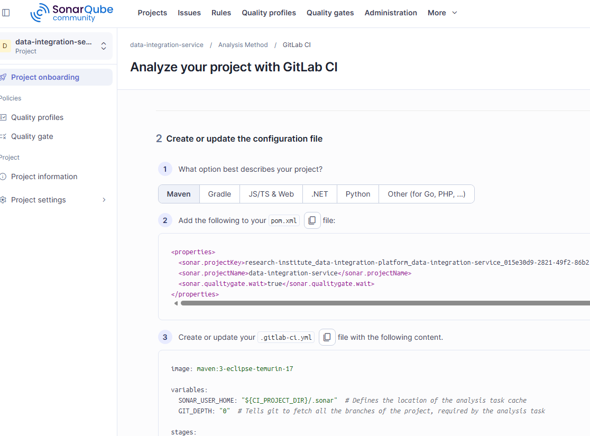

为提升代码质量，实现代码自动检测，引入SonarQube平台。本文介绍如何将GitLab中的项目接入该平台，可以实现对代码进行检测。代码质量检测结果应纳入为流水线强制指标。

<!-- more -->

## Create Project From GitLab

选中GitLab中的项目，进行 Import 导入。

## Set up new code for project

选择“Follows the instance’s default”，点击“Create project”

## Analysis Method

分析方法选择“With GitLab CI”

## Analyze your project with GitLab CI

### Add environment variables

关于环境变量`SONAR_TOKEN`、`SONAR_HOST_URL`，因为是所有项目都通用的，已在群组里面设置了，无需另外生成。

### Create or update the configuration file

选择项目类型，比如Maven。

将SonarQube配置添加到pom.xml的properties中。

在项目的根目录创建`.gitlab-ci.yml`文件，内容根据实际项目需要进行调整。一般会分为单元测试、质量门禁检查、镜像发布等几个阶段。

参考：<https://docs.sonarsource.com/sonarqube-community-build/analyzing-source-code/overview>
